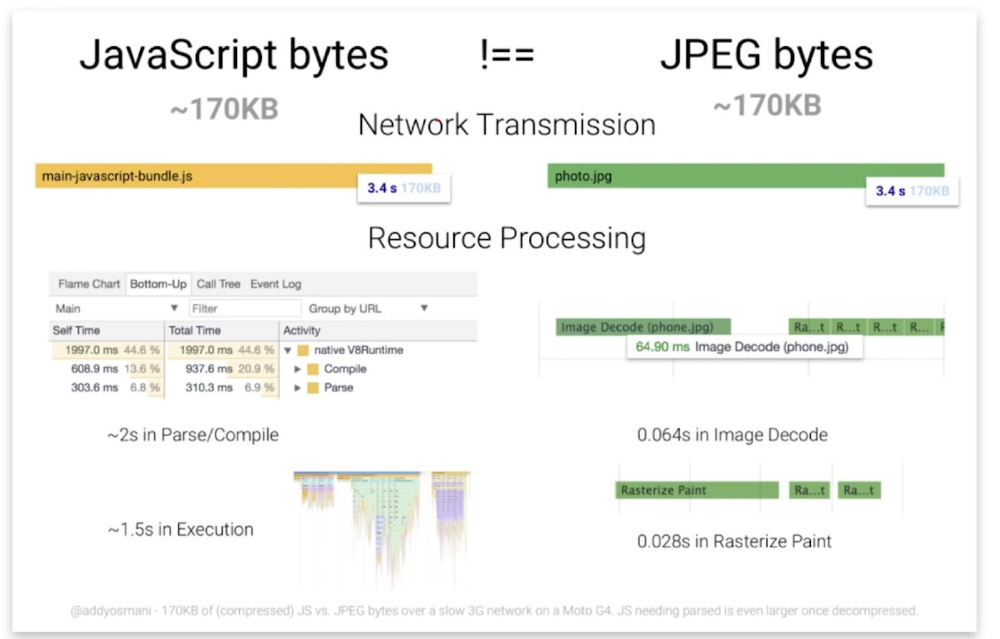

## week 1

### js&python

#### 类型区别

- js: number,Boolean,null,undefined,NaN,Object,Symbol
- python:
  - 不可变:Number（int、float、bool、complex（复数）String（字符串）Tuple（元组,有序）
  - 可变: List（列表,有序）Set（集合,无序）Dictionary（字典,无序）

#### 可变参数

类似于 JS 函数中自动识别传入参数的个数，Python 也提供了定义可变参数，即在可变参数的名字前面带上个 \* 号。

```python
def fn(*args):

    print args

fn()  # ()

fn('a') # ('a',)

fn('a', 'b') # ('a', 'b')
```

#### 匿名函数

- python 中只能有一行表达式,直接 return

```python
sum = lambda arg1, arg2: arg1 + arg2
# 调用sum函数
print ("相加后的值为 : ", sum( 10, 20 ))
# 相加后的值为 :  30
```

#### 装饰器

decorator 装饰器

ES6 的语法中的 decorator 正是借鉴了 Python 的 decorator。decorator 本质上就是 一个高阶函数，它接收一个函数作为参数，然后返回一个新函数

### 行内元素

- 不会独占一行，一行可以存在多个行内元素
- 行高是行内元素的容器，决定其占位是否。
- 存在基线，每个元素都在其基线上，一行中每个元素基线的位置默认为行高最高的元素(即基准元素，也等于行框)的基线。vertical-align 用来设置垂直位置，middle 为行内所有中线对齐。
- 行内块元素也遵循基线对齐，行内块元素的基线为元素里面最后一行的基线。若里面没有元素则为其底线。

### float 问题

- float 会脱离所在父元素内的文档流(故不会离开父元素，也不会被父元素计算空间)
- float 漂浮后变为没有基线的行内块元素
- float 元素遇到同类 float 的元素或者定位元素时会停止漂浮（position）
- 父元素可以通过设置 overflow 为 hidden 强制计算 float 元素空间来防止塌陷，也可通过其最后子元素 clear 属性保留高度。

## week 2

### clientX、clientY

点击位置距离当前 body 可视区域的 x，y 坐标

### pageX、pageY

对于整个页面来说，包括了被卷去的 body 部分的长度

### screenX、screenY

点击位置距离当前电脑屏幕的 x，y 坐标

### offsetX、offsetY

相对于带有定位的父盒子的 x，y 坐标

### x、y

和 screenX、screenY 一样

### height-top

- offsetTop 为元素 top 距离祖先元素的距离，若计算绝对到顶端的距离可以使用 scollY+obj.getBoundingClientRect.Y(元素到窗口的高度)
- offsetHeight 为元素高度包括 padding 和 border，也可直接用 height,scrollHeight 若子元素大于父元素则为子元素的高度
- innerHeight 为 窗口的高度
- window 事件 :page 鼠标到页面顶的坐标,包括卷入的高度,client 不包括 border

### 关键渲染路径

#### 基本渲染前流程

html=>dom-|  
css=>cssom-| =>download+resolve=>renderTree=>begin render=>style  
js------------ |

> - renderTree 是渲染树,不包括 DOM 中的 display 为 none 的对象
> - cssom,css 对象模型
> - js 的 load 会阻塞页面第一次渲染,这是浏览器策略(chrome),在第一次会加载完 js 再渲染防止重复渲染.因此若页面存在 js 时,由于需要顺序等待加载 js 的缘故,transition 在进入页面时将看不见

#### 渲染(render)路径

style>layout>paint>composite
应用中的元素样式>这些元素生成形状和位置——布局>每个元素填充像素>绘制这些图层

#### 重绘(repainting)和重排(reflow)

- Reflow（回流/重排）：当它发现了某个部分发生了变化影响了布局，渲染树需要重新计算。
- Repaint（重绘）：改变了某个元素的背景颜色，文字颜色等，不影响元素周围或内部布局的属性，将只会引起浏览器的 repaint，根据元素的新属性重新绘制，使元素呈现新的外观。重绘不会带来重新布局，并不一定伴随重排；
  Reflow 要比 Repaint 更花费时间，也就更影响性能。所以在写代码的时候，要尽量避免过多的 Reflow。

> 故应该尽量用 transform 这样的不改变布局的属性,既不会 repaint 也不会 reflow；

#### 渲染在什么时候执行

当宏任务执行之前,或者说一个 eventloop 的最后(marco 和 mircao 之后)
例如:

```js
function heavy() {
  document.body.style.background = "red"
  //do some such heavy things,it cost 2s to deal
}
heavy() // the body can't render until 2s later
```

### =100%?/

- 最上级的 100%为是视窗大小的 100%
- 绝对定位的 100%包括 padding 大小，其他则只包括内容。（起始位置都从父元素的 content 左上角开始;若 top:0,则从 border 开始,不包括 border 大小)

### 从头开始 debounce

```js
function debounce(func, wait = 20, immediate = true) {
  var timeout
  return function() {
    var context = this,
      args = arguments
    var later = function() {
      timeout = null //非立刻执行时,通过回调timeout来判断是否渡过wait
      if (!immediate) func.apply(context, args)
    }
    var callNow = immediate && !timeout
    clearTimeout(timeout) //防抖重点,节流则不需要
    timeout = setTimeout(later, wait)
    if (callNow) func.apply(context, args)
  }
}
window.addEventListener("scroll", debounce(func))
```

- Q1：元素事件处理器所绑定的 handle 到底是什么？  
  A：handle = debounce(func),每次事件触发将执行的是 debounce 的 return ，即 function。

- Q2：如何每次都能取到 timeout?  
  A: 通过闭包，每次调用 function 时，遇到 timeout 标识符若本函数内词法环境中没有，将根据该函数的[[environment]]\(函数自身注册时的词法环境\)中寻找(作用域链)，词法环境在函数创建时生成。 debounce 作为声明，在全局中处理代码之前就应经解析创建注册。
  ps:js 中所有的标识符寻找都通过作用域链，即取决于变量函数写在哪个作用域内。如下：

  ```javascript
  var a = function() {
    console.log(time)
  }

  function debounce1() {
    var time = 1
    a() //not defined
    return function() {
      time = time + 1
      console.log(time) //2
      a() //not defined
    }
  }
  debounce1()()
  ```

- Q3: timeout=seTtimeout() ，赋的是什么值？  
  A: 赋值的是计时器`ID`，存在于浏览器中的全局变量， 每执行一次`setTimeout`都会+1，代表该计时器的序号。`clearTimeout`将取消计时器，包括其中的回调函数，但不会回收其`ID`。

- Q4: 为什么要赋值 this？  
  A:因为 setTimeout 为全局函数，是浏览器所处理，无论在哪里执行 this 都是全局。

- Q5: immediate 是什么？  
  A:immediate 用来决定是否立即执行，即决定事件通过回调来执行还是通过判断 timeout 来立即执行。当 immediate 为 true 则是判断 timeout,故第一下就能立即执行，当为 false 时需成功完成等待事件才能回调。

### 两种数据类型

- 基本数据类型

  - 包括，string(utf-16),null,undefine,boolean,number(8 字节),
  - 存储内容，变量名与数据本身
  - 存储位置，栈内存

- 引用数据类型

  - 包括，function,array,object
  - 存储内容：变量名与属性的指针(地址)
  - 属性指针在栈内存，指针指向的内容在堆内存

- PS: 栈与堆

> 栈内存，有序存储，容量小但分配效率高，易于回收是一种向低地址扩展的数据结构，并且是连续的存储空间，所以栈顶和栈的最大容量是固定的  
>   
>   
> 堆，是一种向高地址扩展的数据结构，并且是不连续的，因为系统采用的是链表的方式存放空闲存储块，当然是不连续的，链表的遍历方向是由低向高的，所以堆能够申请的空间的大小其实等同于整个系统的虚拟内存，只要还有内存空间，那么堆就能够不受限制的申请空间，这种方式比较灵活，申请空间也较大。

### js 的隐式转换

- 一元运算符 通过+、-字符串将转化为数字类型

```js
var sNum = "20"
alert(typeof sNum) //输出 "string"
var iNum = -sNum
alert(iNum) //输出 "-20"
alert(typeof iNum) //输出 "number"
```

- 加法计算
  若存在字符串将默认将其他元素转换为字符串进行拼接

```js
var result = 5 + 5 //两个数字
alert(result) //输出 "10"
var result2 = 5 + "5" //一个数字和一个字符串
alert(result) //输出 "55"
```

- 正则
  默认将内容转换为字符串

```js
let reg = new Reg("^[0-9a-z]+$", "gi") //
reg.test(undefined) //返回true
```

## week 3

### Iterables 和 array-like

两种对象类型

#### 分辨特征

- array-like 有 length 属性
- Iterables 有[Symbol.iterator]方法

#### Iterables

Iterables 意为可迭代的对象,当用`forEach`,`for of`时,会调用其[Symbol.iterator]方法(也可直接称作生成器`generator`),生成 iterator,然后依次调用`iterator.next()`完成迭代

> `for of`内部实现

```js
let str = "Hello"

// 和下面代码完成的功能一致
// for (let char of str) alert(char);

let iterator = str[Symbol.iterator]()

while (true) {
  let result = iterator.next()
  if (result.done) break
  alert(result.value) // 一个一个输出字符
}
```

> 让一个对象变成 iterable

```js
let normalObj = { a: 2, b: 3 }

normalObj[Symbol.iterator] = function() {
  let arr = Object.keys(this)
  let i = -1
  return {
    next: () => {
      i++
      return this[arr[i]]
        ? { done: false, value: this[arr[i]] }
        : { done: true }
    },
  }
}

for (const value of normalObj) {
  console.log(value)
} // 2 3
```

### array map set

- array

  - 基本数组类型，创建方式 2 种：`[]`和`new Array()`,故将继承数组类的属性与方法
  - 常用方法：  
    `.forEach(callback)`遍历回调;  
    `.every(ninja => "name" in ninja)`遍历所有判断是否都有"name"接受回调 Boolean 值，若全部为`ture`则返回`ture`;  
    `.some(ninja => "name" in ninja)`,遍历直至一个`ture`就返回;  
    `ninjas.find(ninja => ninja.weapon === "wakizashi"）`使用 find 方法查找满足回调函数中指定条件的第 1 个元素，否则为 undefined  
    `.indexOf(value)`和`.findIndex(ninja =>ninja =="yoshi")`都返回满足的元素的索引;  
    `.sort(num1,num2 => num1>num2?return 1;return -1)`,通过回调比较相邻两个数对其排序,若为 1 则交换位置.  
    `filter(ninja => callback)`,返回 callback 为真的数组,  
    `reduce(function(total, currentValue, currentIndex, arr), initialValue)`,累加器,回调的返回值最为 total 依次累加.

- map

  - 字典数组类型,创建方式:`new Map([a,...])`
  - 特点:纯粹的字典映射,不继承普通对象的方法,比如`constructor`,同样也去除了`key`必须是字符串的限制  
    　 map 是键值对的集合，key 可以是任意类型的值，甚至可以是对象
  - 常用方法:example:`const ninjaIslandMap = new Map();ninga1={name:"yoshi",}`.
    `ninjaIslandMap.map.set(ninja1, { homeIsland: "Honshu"})`,则设置了 ninja1 和`{ homeIsland: "Honshu"}`的映射,`ninjaIslandMap.map.get(ninja1).homeIsland =='honshu'`  
    `for of`对其中每个元素进行遍历,返回每个元素本身,包括 key 和 value.`for in`则只返回 key  
    `.has(key)`通过对 key 进行 hash 运算后散射得到其 index 值,故能直接通过 key 进行哈希散射后匹配`map[hash(key)]`,所以时间复杂度为 O(1),可利用其进行判断去重.

- set
  - 唯一数组类型,创建方式:`new Set([a,...])`
  - 特点:成员的值唯一,内部为二叉树.

## week 4

### 正则

- 创建方式`reg =/\d+/gi` 或者`reg = new Reg('\d+ ')`

在 JavaScript 中，有 5 个修饰符：

> i 使用此修饰符后，搜索时不区分大小写: A 和 a 没有区别。  
> g 使用此修饰符后，搜索时会查找所有的匹配项，而不只是第一个（在下一章会讲到）。  
> m 多行模式,每行进行匹配,^\$匹配每行,可用\n 替代,但是最后一行不能匹配,。  
> u 开启完整的 unicode 支持。该修饰符能够修正对于代理对的处理。  
> y 粘滞模式，通过 reg.lastIndex=6,可以从 str[6]开始匹配

- 常用使用方法：

  - `str.search(reg)`返回匹配的索引,没有则返回-1
  - `str.match(reg)`没有 g 修饰符时，结果是一个数组，里面有该第一个匹配项和额外的属性：index – 匹配项在字符串中所处在的位置，
    input – 原始字符串。；有 g 修饰符时，就会返回由所有匹配项组成的数组。在数组中没有`额外的属性`，而且`圆括号`也不会创建任何元素。
  - `str.replace(reg,function||str)`,返回替换后的 NEWstr,但不改变自生 str(与 python 不同)
  - `reg.test(str)`用于检测是否存在可以匹配的 str，返回 boolean 值,一般用`^`和`$`来检测整个字符串

- 字符集合: -`\d`（“d” 来源于 “digit”）一个数字：0 到 9 的一个字符。;`\D` 一个非数字
  - `\s`（“s” 来源于 “space”）一个空格符：包括空格，制表符和换行符。;`\S` 一个非空格符
  - `\w`（“w” 来源于 “word”）一个单字字符：英语字母表中的一个字母
    或者一个数字或一个下划线。非英语字母（像西里尔字母或者印地语）不包含在 `\w`里面。
    ;\W 一个非数字字母和\_
  - `.`可以匹配换行符外的任意字
  - _如果我们想要检索一个像反斜杠或者一个点这样有特殊意义的字符，那么我们需要使用一个反斜杠 \. 进行转义。_
    特殊字符的列表：`[ \ ^ $ . | ? * + ( )。`,js 中的`' "`不包括.
- 范围:
  - [][0-9a-z]
- 量词:
  - 数量 {n}:确切的位数：{5};某个范围的位数：{3,5}
  - `+`代表“一个或多个”，相当于 {1,}。
  - `?` 代表“零个或一个”，相当于 {0,1}。
  - `*` ：代表着“零个或多个”，相当于 {0,}
- 捕获组:

  - 正则模式的一部分可以用括号括起来 (...)，由此构成一个『捕获组』。正则引擎可以记录捕获组
  - eg:  
    `不带g时`

  ```js
  let str = "<h1>Hello, world!</h1>"
  let reg = /<(.*?)>/

  alert(str.match(reg)) // Array: ["<h1>", "h1"]
  ```

  `带g时`

  ```js
  let str = "<h1>Hello, world!</h1>"

  // 两组匹配：起始标签 <h1>和闭合标签</h1>

  let reg = /<(.*?)>/g

  let match

  while ((match = reg.exec(str))) {
    // 第一次显示匹配：<h1>,h1
    // 之后显示匹配：</h1>,/h1
    alert(match)
  }
  //如此我们便得到了 <(.*?)> 的两个匹配项，他们中的每一个都包括完整的匹配和对应的捕获组。
  ```

  - 捕获可嵌套:从括号开始从左到右依次编号,
    返回数组的索引从为 0 的整个匹配项开始,无论捕获存不存在都会返回值(`value||undefined`),
    通常使用 result.shift() 去头后提取所有匹配项
  - 可用`?:`来排除组
  - `$n`可用作替换文本表示捕获组,`\n`用作模式表达式中,表示匹配与该组相同的内容(:?不记录)

- 选择（OR）|
  - `|`可以用来进行多个模式的匹配,通过 g 能够返回所有满足其一的内容,可用()来规定|范围
- 开始符 ^ 和结束符 \$
  - ^\$为所匹配字符串的开头和结尾,与 Y 标识符相似
  - 我们可以同时使用这两个符号，来检查字符串是不是*完全匹配正则表达式*。这经常用于信息校验.
  - ^\$可以匹配 ""
- 前瞻断言与后瞻断言

  - .match 只返回断言的内容

| 模式   | 类型         | 匹配                 |
|--------|--------------|----------------------|
| x(?=y) | 前瞻肯定断言 | x ，仅当后面跟着 y   |
| x(?!y) | 前瞻否定断言 | x ，仅当后面不跟 y   |
| (?=y)x | 后瞻肯定断言 | x ，仅当前面跟着 y   |
| (?!y)x | 后瞻肯定断言 | x ，仅当前面不跟着 y |

### getElementBy..()和 querySelector()

- 主要区别:get 是获取 node 的指针(node 变,则随其改变),query 深克隆获取具体 node.

#### 总结

有 6 种主要的方法，可以在 DOM 中进行搜素：

<table>
<thead>
<tr>
<td>Method</td>
<td>Searches by...</td>
<td>Can call on an element?</td>
<td>Live?</td>
</tr>
</thead>
<tbody>
<tr>
<td><code>getElementById</code></td>
<td><code>id</code></td>
<td>-</td>
<td>-</td>
</tr>
<tr>
<td><code>getElementsByName</code></td>
<td><code>name</code></td>
<td>-</td>
<td>✔</td>
</tr>
<tr>
<td><code>getElementsByTagName</code></td>
<td>tag or <code>'*'</code></td>
<td>✔</td>
<td>✔</td>
</tr>
<tr>
<td><code>getElementsByClassName</code></td>
<td>class</td>
<td>✔</td>
<td>✔</td>
</tr>
<tr>
<td><code>querySelector</code></td>
<td>CSS-selector</td>
<td>✔</td>
<td>-</td>
</tr>
<tr>
<td><code>querySelectorAll</code></td>
<td>CSS-selector</td>
<td>✔</td>
<td>-</td>
</tr>
</tbody>
</table>

请注意，只有在文档 `document.getElementById(...)` 的上下文中才能调用 `getElementById` 和 `getElementsByName`。但元素中没有 `elem.getElementById(...)` 会报错。

也可以在元素上调用其他方法，例如 `elem.querySelectorAll(...)` 将会在 `elem`（在 DOM 子树中）内部进行搜素。

除此以外：

- `elem.matches(css)` 用于检查 `elem` 与给定的 CSS 选择器是否匹配。
- `elem.closest(css)` 用于查找与给定 CSS 选择器相匹配的最近的祖先。`elem` 本身也会被检查。

最后我们在提一种检查父子关系的方法：

- 如果 `elemB` 在 `elemA`（`elemA` 的后代）中或者当 `elemA==elemB` 时 `elemA.contains(elemB)` 将返回 true。

### readystate 和 status

两个不过程的状态码

#### readystate 为 XML httpRequest 请求过程的不同阶段

- 1=>请求尚未初始化, 已经创建 XMLHttpRequest 对象
- 2=>服务器链接已经建立, 已经调用了 XMLHttpRequest 对象的 open 方法，并且 XMLHttpRequest 对象已经准备好将一个请求发送到服务器端
- 3=>请求已经发送, 已经通过 send 方法把一个请求发送到服务器端，但是还没有收到一个响应
- 4=>请求处理中, 已经接收到 HTTP 响应头部信息，但是消息体部分还没有
- 5=>完全接收到请求完成, 且响应已经就绪

#### status 为请求在服务端响应的结果

- 1XX 服务器收到请求，需要继续处理。例如 101 状态码，表示服务器将通知客户端使用更高版本的 HTTP 协议。
- 2XX 请求成功。例如 200 状态码，表示请求所希望的响应头或数据体将随此响应返回。
- 3XX 重定向。例如 302 状态码，表示临时重定向，请求将包含一个新的 URL 地址，客户端将对新的地址进行 GET 请求。
- 4XX 客户端错误。例如 404 状态码，表示客户端请求的资源不存在。
- 5XX 服务器错误。例如 500 状态码，表示服务器遇到了一个未曾预料的情况，导致了它无法完成响应，一般来说，这个问题会在程序代码出错时出现。

## week 5

### event.target 和 event.currentTarget

- 主要区别:event.target 是触发事件开始的元素,event.currentTarge 是*当前触发事件执行*的元素(被监听该事件的元素
  )

### ES6 destruction

- 解构的意义: 更快的将变量赋值为对象中的属性.
- 主要方法:

```js
 let obj={
   time:60,
   mode:"custom",
   text:"hello"
 }
 let {time} = obj  ||  let {time:localTime} =  obj
 console.log(time||localTime) //60
```

### class 中静态 static

- static 的意义:用来处理不需要访问实例属性的专属方法,例如 Array.spice ,Promise.race
- static 的原生写法: `Array.slice = (array,start,end)=>array[start,end]`

## week6

### 偏函数(partial function)&&纯函数(Pure Functions)

#### 偏函数

- 偏函数的意义:将多参数的函数固定几个参数后变为少参数函数,例如 send(from,to) =>> toSend(to)

- 两种途径:

  - `bind`

  ```js
  function partial(func, ...argsBound) {
    return function(...args) {
      // (*)
      return func.call(this, ...argsBound, ...args)
    }
  }
  ```

  - `currying`

  ```js
  function curry(func) {
    return function curried(...args) {
      if (args.length >= func.length) {
        return func.apply(this, args)
      } else {
        return function(...args2) {
          return curried.apply(this, args.concat(args2))
        }
      }
    }
  }
  ```

#### 纯函数

- 纯函数定义
  函数类的变量都在函数作用域内,不依赖外部变量,保证函数在任何环境同一输出

- 纯函数意义
  - 容易可测试(testable)
  - 因为相同的输入必定是相同的输出，因此结果可以缓(cacheable)
  - 自我记录(Self documenting),因为需要的变量都是参数，参数命名良好的
  - 情况下即便很久以后再去看这个函数依旧可以很容易知道这个函数需要哪些参数
  - 因为不用担心有副作用(side-effects),因此可以更好地工作

### react 和 vue 子向父跨组件通信的几种方法

#### react

- 通过在父子间中创建函数(绑定对象后)传递给子组件,则子组件变化运行函数后则父子间变化.
- 通过 context (redux)等全局变量
- 利用 pub/sub 模式,例如创建使用 Node.js EventEmitter 进行发射,接受,子组件发射(emit),父子间接受(onEmit)

#### vue

- this.\$emit
- Vue.bus
- this.\$parent
- context(redux)

### react CSS 的几种写法

- 直接写在 CSS 上 `Import css`文件
- 写在 JS 文件中,`const headingStyle={fontSize:"60px"}`
- 使用 css.module(higher "react-scripts" 2.0),`import style from ".module.css" style={style.class}` 与普通 CSS 全局变量不同,存在本地文件作用域

## week7

### 事件循环和消息列队

- 采纳 JSC 引擎的术语，我们把宿主（浏览器、Node 环境）发起的任务称为宏任务（如 SetTimeout,requestAnimationFrame(requestAnimationFrame 的步伐跟着系统的刷新步伐走。它能保证回调函数在屏幕每一次的刷新间隔中只被执行一次，这样就不会引起丢帧现象，也不会导致动画出现卡顿的问题。  
  把 JavaScript 引擎发起的任务称为微观任务（如 Promise）。

```js
console.log("1")
setTimeout(() => console.log("2"), 1)
Promise.resolve().then(() => console.log("3"))
console.log("4")
// 1 4 解析执行主线程JS 属于第一个事件循环(宏任务),同步任务执行完
// 3  进入微任务队列,在下个宏任务(2)执行前执行
// 2 执行最后一个宏任务
```

### this

- 存储在对象中函数称之为『方法』。
- 对象执行方法进行『操作』，比如 `object.doSomething()`。
- 方法可以将该对象引用为 `this`。

`this` 的值是在运行时求值的。

- 函数声明使用的 `this` 只有等到调用时才会有值。
- 函数可以在对象之间进行共用。
- 当函数使用『方法』语法 `object.method()` 调用时，调用过程中的 `this` 总是指向 `object`。
  - 这个 '.' 点返回的*不是一个函数*，而是一种特殊的引用类型的值。

> 引用类型是一种『规范中有的类型』。我们不能明确地指定它，但是可以在语言内部使用。
> 引用类型的值是三点的结合 (base, name, strict)，如下：  
> base 是对象。  
> name 是属性。  
> 当 use strict 生效，strict 为真。

请注意箭头函数有些特别：它们没有 `this`。  
箭头函数的`this`在创建时确定,由于创建时的环境属于其函数本身外部,也可说=>在箭头函数内部访问`this`的都是来自外部的 `this` 值,_?_

## week 8

### null 和 undefined

- 用 typeof 和 instanceof 测试一下区别

```js
typeof null //"object"
typeof undefined //"undefined"
null instanceof Object //false
null instanceof null //true
null == undefined // true
null === undefined //false
Object.prototype.toString.call(undefined) //"[object Undefined]"
Object.prototype.toString.call(null) //"[object null]"
```

> typeof(null)中表示是对象,但在 instance 中却又是 null,而在 ES6 标准中明确表示 null 是一个基本类型,那么 null 到底是什么呢

- null 属于历史遗留问题
  现在比较普遍的认知是，typeof null 返回“object”是一个历史错误（JS 的发明者 Brendan Eich 自己也是这样说的,null 的类型机器码全为 0,而对象的前三位也为 0,typeof 则是判断类型机器码的前三位），只是因为要保持语言的兼容性而维持至今。从 ES5 制定开始就有动议将 typeof null 改为返回“null”（如启动 node 加上“--harmony_typeof”参数，即是如此），但是当前 ES6 标准草案仍然维持了原样。

- null 和 undefined 的使用
  - null 是一个存在的`空`,当需要指定变量为`空`时,可以使用 null 表明此变量是有一个指向的,但指向一个`空`;
  - 而 undefined 是指一个还没有确定指向目标的变量,将来可以任何值,但现在没有指向

### outline

#### 是什么

元素 border 外的充填内容

### package.json 和 package-lock.json

#### 区别

- package.json 是 install XX 的直接依赖,并随着 install 的改变,版本前有`^`号表示可以用之后的最新版本
- package-lock.json 是 package.json 生成时候自动生成,包含 install 时的具体版本号,及其所有间接依赖,当之后 update 包时,直接依赖会更新,但间接依赖不更新

#### 用法

- 若 package.json 发生更新后,`npm install`将根据`package.json` install(注意，`npm ci` 在安装前会自动清除现存的 `node_modules`，所以 npm ci 天然规避了增量安装可能带来的不一致性等问题)
- 若希望使用最初的锁定版本,则使用 `npm ci`下载`package-lock.json`中的依赖

## week 9

### 微服务和 serverless 和 docker

#### 微服务

服务端设计思想,后端应用组件化,API 分离,去中心化,每个 API 独立部署

> 

#### serverless

服务端部署架构,将后端部署在云服务提供商提供的自动化的弹性服务器上,让开发者专注于逻辑层

#### docker

一个开源的应用容器引擎，可以将应用打包在一个一个可移植的镜像中，然后发布到 Linux 或 window 上，容器之间相互隔离，采用 c/s 构架进行操作管理

#### 联系

可用微服务思想,将服务组件(不同的 API)部署再不同的云上（或将不同组件放置在不同的 docker 中）,从而能够快速更迭,

### vue 和 react "异步"更新的差异

> 这里假设都已满足异步的条件

#### 对象上

vue 在执行 update 时开始异步,则不能同步取到 dom  
react 在更改 state 时开始异步,则不能同步取到 state

#### 方法上

vue 合并 watcher,react 合并 state

#### 相同点

都采用列队(批量更新)策略

### 什么是 base64

#### 定义

一个编码规则,用来将传输中不可见的二进制的文件转化为 64 个可见字符.

#### 用途

- 将二进制图片转换为 文件传输
  base64

#### 方法

- 在浏览器中用`window.btoa`encode,`window.atob`decode
- 在 canvas 中`ctx.toDataURL(mimeType,quality:0~1,'compressRatio'):base64`

### axios 中的坑

#### authorization

axios.`get/post...`中设置 authorization 没用,需要用`axios({ method:"", url:"", data:"", headers:"" , })`

#### interceptor,在 transformData,transformHeader 之前

所以如果在 headers 中设置`content-type`,在 interceptor 中还是`content-type`,之后才会`transformHeaders`成`Content-Type`

### dom 有很多节点

#### 常用节点

- elementNode
- textNode
- attributeNode

#### 其他节点

- CDATA 节点 Node.CDATA_SECTION_NODE(4)
- 实体引用名称节点 　 Node.ENTRY_REFERENCE_NODE(5)
- 实体名称节点 　　 Node.ENTITY_NODE(6)
- 处理指令节点 　　 Node.PROCESSING_INSTRUCTION_NODE(7)
- 注释节点 　 Node.COMMENT_NODE(8)
- 文档节点 　 Node.DOCUMENT_NODE(9)
- 文档类型节点 　　 Node.DOCUMENT_TYPE_NODE(10)
- 文档片段节点 　　 Node.DOCUMENT_FRAGMENT_NODE(11)
- DTD 声明节点 Node.NOTATION_NODE(12)

### babel

#### 机制

- parse to AST
- transform
- generater

## week10

### preload 和 prefetch
明白预加载和预获取需要首先清楚浏览器使用资源的流程  
其流程基本可以分为两个部分  Network Transmisson(资源的网络传输) | Resource Processing (资源处理、加工、执行)   
>例如js文件，首先网络下载后，处理的过程包括编译和执行  
图片文件，网络下载后，处理的过程包括解码和绘制




#### preload

- 定义
  优先预加载，_优先级高_，可以在 render tree 时候异步下载(transmission)，但不会执行导致 render 阻塞，在render完后执行(processing)

- 用法  
  `<link rel="preload" href="..." as="..." type="..." onload="preloadFinished()">`
  可定义回调函数
  > `as`可以为`script`、`image`、`style`、`audio`、`font `、etc.
#### prefetch

- 预获取，_优先级低_,将在页面加载完成后提前下载但不会加载(transmission)，作为下一页的部分，调取时执行(processing)

- 用法与preload基本一致

#### 应用

在 VUE SSR 生成的页面中，首页的资源均使用 preload，而路由对应的资源，则使用 prefetch

#### 扩展

给 script 标签设置`defer`和`async`也能延迟 load,两者都能异步 load(在执行 css,html 文件时下载)

- `async`*该 JS 文件*load 完后才执行该文件
- `defer`*页面*加载完后才执行该文件

### lazy-load

### SEO 策略

#### title

#### keywords

#### description

### 汇编语言 (assembly language)

#### 简单定义

机器码的标识符，可利用汇编编译器直接编译为机器码

#### 特点

- 高效，编译更直接，代码直接操作硬件
- 逻辑简单，不易编写复杂应用
- 不易维护

### intersectionObserver

#### 定义

提供了一种异步观察目标元素与其祖先元素或顶级文档视窗(viewport)交叉状态的方法。可代替监听 scroll 事件中不停获取 getBoundingClientRect()，从而优化性能

#### 使用方法

```js
var options = {
  root: document.querySelector("#scrollArea"), //设置需监听的相对元素，默认为视窗
  rootMargin: "0px", //距离补偿
  threshold: 1.0, //监听元素出现在ROOT中的比例，1.0则是全出,可以为数组`[0,0.5,1]`,每到一个阈值都会执行一次回调
}
//callback 当出现时候的回调函数
var observer = new IntersectionObserver(callback, options)
var target = document.querySelector("#listItem")
observer.observe(target) //开始监听#listItem元素
```

- `.observe(element)`

```js
var target = document.querySelector("#listItem")
observer.observe(target) //开始监听#listItem元素
```

- `.unobserve(element)`
  停止监听 element
- `.disconnect()`
  停止对象监听工作

#### 实现图片懒加载

```html


```

```js
const imgs = document.qureySelectorAll("[data-lazy]")
const obImg = target => {
  const ob = new IntersectionObserver(([entry, ...entrys]) => {
    if (entry.isIntersecting) {
      entry.target.src = entry.target.dataset.lazy
      ob.disconnect()
    }
  })
  ob.observe(target)
}

imgs.forEach(obImg)
```

### Immutable.js

### vue 收集哪些依赖

相应数据只收集渲染函数和监听属性,

#### render function

```js
components.forEach(component => autoRun(component.render))
```

#### watch

```js
Object.defineProperty(this, watchedData, {
  set() {
    watchedData()
  },
})
```

#### computed

```js
let computedData //用来缓存合成属性,render时直接读取
computedDatas.forEach(computedData => autoRun(computedData()))
```

### component 和 pureComponent

#### 主要区别

- component 每次 setState 都会重新 update(render)

- pureComponent 每次 setState 后会`shouldeComponentUpdate`

```js
if (this._compositeType === CompositeTypes.PureClass) {
  shouldUpdate =
    !shallowEqual(prevProps, nextProps) || !shallowEqual(inst.state, nextState)
}
```

> 因此,使用 pureComponent 可以一定程度上减少不必要的渲染

#### pureComponent 浅比较原理

```js
// 用原型链的方法
const hasOwn = Object.prototype.hasOwnProperty

// 这个函数实际上是Object.is()的polyfill
//+0 === -0 // true，但我们期待它返回false
//NaN === NaN // false，我们期待它返回true
function is(x, y) {
  // SameValue algorithm
  if (x === y) {
    // 处理为+0 != -0的情况
    return x !== 0 || 1 / x === 1 / y
  } else {
    // 处理 NaN === NaN的情况
    return x !== x && y !== y
  }
}

export default function shallowEqual(objA, objB) {
  // 首先对基本数据类型的比较
  if (is(objA, objB)) return true
  // 由于Obejct.is()可以对基本数据类型做一个精确的比较， 所以如果不等
  // 只有一种情况是误判的，那就是object,所以在判断两个对象都不是object
  // 之后，就可以返回false了
  if (
    typeof objA !== "object" ||
    objA === null ||
    typeof objB !== "object" ||
    objB === null
  ) {
    return false
  }

  // 过滤掉基本数据类型之后，就是对对象的比较了
  // 首先拿出key值，对key的长度进行对比

  const keysA = Object.keys(objA)
  const keysB = Object.keys(objB)

  // 长度不等直接返回false
  if (keysA.length !== keysB.length) return false
  // key相等的情况下，在去循环比较
  for (let i = 0; i < keysA.length; i++) {
    // key值相等的时候
    // 借用原型链上真正的 hasOwnProperty 方法，判断ObjB里面是否有A的key的key值
    // 属性的顺序不影响结果也就是{name:'daisy', age:'24'} 跟{age:'24'，name:'daisy' }是一样的
    // 最后，对对象的value进行一个基本数据类型的比较，返回结果
    if (!hasOwn.call(objB, keysA[i]) || !is(objA[keysA[i]], objB[keysA[i]])) {
      return false
    }
  }

  return true
}
```

> 由上面的分析可以看到，当对比的类型为 Object 的时候并且 key 的长度相等的时候，浅比较也仅仅是用 Object.is()对 Object 的 value 做了一个基本数据类型的比较，所以如果 key 里面是对象的话，有可能出现比较不符合预期的情况，所以浅比较是不适用于嵌套类型的比较的。  
> 例如,`shallowEqual({a:{b:2}},{a:{b:2}}) == false`

#### 浅比较的补充-Immutable.js

> 由于深浅比较不能判断相同的引用类型数据的变化,例如  
> `const { data } = this.state;data.push(news) setState({data})`
> 则不能发现改变,可以利用`Immutable.js`这个库解决此问题

- 什么是 Immutable.js  
  Facebook 在 2014 年出的持久性数据结构的库，持久性指的是数据一旦创建，就不能再被更改，任何修改或添加删除操作都会返回一个新的 Immutable 对象。可以让我们更容易的去处理缓存、回退、数据变化检测等问题，简化开发。并且提供了大量的类似原生 JS 的方法，还有`Lazy Operation`的特性，完全的函数式编程。

### webpack

#### webpack 作用

将所有依赖一起打包的工具.

> 任何时候，一个文件依赖于另一个文件，webpack 就把此视为文件之间有 依赖关系。这使得 webpack 可以接收非代码资源(non-code asset)（例如 images 或 web fonts），并且可以把它们作为 _依赖_ 提供给你的应用程序。
> webpack 从命令行或配置文件中定义的一个模块列表开始，处理你的应用程序。 从这些 入口起点 开始，webpack 递归地构建一个依赖图，这个依赖图包含着应用程序所需的每个模块，然后将所有这些模块打包为少量的 bundle - 通常只有一个 - 可由浏览器加载。

#### webpack 简单理解

> webpack 整体是一个插件架构，所有的功能都以插件的方式集成在构建流程中，通过发布订阅事件来触发各个插件执行。webpack 核心使用 Tapable 来实现插件(plugins)的 binding 和 applying.

#### 打包过程

- 读取文件分析模块依赖
- 对模块进行解析执行(深度遍历)
- 针对不同的模块使用相应的 loader
- 编译模块，生成抽象语法树 AST。
- 循环遍历 AST 树，拼接输出 js

#### loader 和 plugin

##### loader

webpack 本身只处理 js 文件中的依赖关系(`import /export`),对其他内容或不同文件可通过 loader 进行编译
Loaders 是用来告诉 webpack 如何转化处理某一类型的文件，并且引入到打包出的文件中

> 常用 loader:`file-loader(deal png)`,`css-loader(deal style)`,`babel(deal es6)`

##### plugin

webpack 插件是一个具有 `apply` 属性的 `JavaScript` 对象。`apply` 属性会被 `webpack compiler` 调用，并且 `compiler` 对象可在整个编译生命周期访问。
这个 apply 方法在安装插件时，会被 webpack compiler 调用一次。apply 方法可以接收一个 webpack compiler 对象的引用，从而可以在回调函数中访问到 compiler 对象。一个简单的插件结构如下：

```js
function HelloWorldPlugin(options) {
  // 使用 options 设置插件实例……
}

HelloWorldPlugin.prototype.apply = function(compiler) {
  // 初始时通过apply将插件注入到 compiler周期钩子中
  compiler.plugin("done", function(compilation) {
    console.log("Hello World!")
     // 现在，设置回调来访问 compilation(compiler的实例) 中的步骤：
    compilation.plugin("optimize", function() {
      console.log("Assets are being optimized.");
  })
}

module.exports = HelloWorldPlugin
```

> - 常用 plugin:`CommonsChunkPlugin (extract common module in different bundle)`,`HtmlWebpackPlugin(简单创建 HTML 文件，用于服务器访问)`,`UglifyJsPlugin(compress js file)`

### 扩展运算符(...)

#### 定义

用来取出变量中的所有可遍历属性,属于对属性的一次浅拷贝

> `...[a,b,c]===> a b c`

#### 常用方法

- 函数参数的解构

```js
function foo(a, ...b) {
  //此时相当于 let [a,...b]=agruments
  // ...b ==> argruments[1] argruments[2]  argruments[3] ~~~
  console.log(b)
}
foo(1, 2, 3, 4) // [2,3,4]
```

> ps `...`只能用在最后一位

- 将 Iteratable(可迭代对象) 的类型转为数组

```js
const nodeList = document.querySelectorAll("div")

const array = [...nodeList]
```

## week11

### webGL

#### 什么是 webGL


WebGL（全写 Web Graphics Library）是一种 3D 绘图协议，这种绘图技术标准允许把 JavaScript 和 OpenGL ES 2.0 结合在一起，通过增加 OpenGL ES 2.0 的一个 JavaScript 绑定，WebGL 可以为 HTML5 Canvas 提供硬件 3D 加速渲染，这样 Web 开发人员就可以借助系统显卡来在浏览器里更流畅地展示 3D 场景和模型了，还能创建复杂的导航和数据视觉化。

#### 为什么需要 OpenGL


webGL 的优势就是可以利用 GPU 处理图像,GPU 可以多核并行处理将大大优于 CPU 处理图像,而 OpenGL 则是显卡的底层驱动接口,webGL 通过结合 OpenGL 从而实现最好的图形处理途径,以至于能够在浏览器中创造精致的动画.

JavaScript-> Canvas -> WebGL -> OpenGL ->.... -> 显卡

### redis

#### redis 是什么

Redis 是一个使用 ANSI C 语言编写、支持网络、可基于内存亦可持久化的日志型、高性能的 key-value 数据库

#### redis 的作用

- 存储数据在缓存在内存中，可以加快数据的提取发送，在部分场合可以对关系数据库起到很好的补充作用

- redis 会周期性的把更新的数据写入磁盘或者把修改操作写入追加的记录文件，并且在此基础上实现了 master-slave(主从)同步。

### AI 为什么用 python

python 作为一个运行效率在所有语言中倒数的语言为什么成为了 AI 这种主要是计算数据的任务的主流语言?

> 人工智能的核心算法是完全依赖于 C/C++的，而且 Python 历史上也一直都是科学计算和数据分析的重要工具。Python 虽然是脚本语言，但是因为容易学，迅速成为科学家的工具（MATLAB 等也能搞科学计算，但是软件要钱，且很贵），从而积累了大量的工具库、架构，人工智能涉及大量的数据计算，用 Python 是很自然的，简单高效。

#### 易学

对于编程只是副业的 AI 科学家们来说，没那么多时间去学习和使用 C++，还是把大量时间用来研究研究算法比较实在。

#### 调用的数据处理的接口(库)是 C++

Python 虽然慢但是它只是调用 AI 接口，真正的计算全是 C/C++写好的数据底层，用 Python 只是写相应的逻辑，几行代码就出来了。换成 C++的话，不仅代码量太大，而且开发效率太低，不是说用 C++写不了上层逻辑，，而是换来总体速度提升 1%，得不偿失。

#### 生态丰富

Python 在拥有简洁的语法和丰富的生态环境从而提高开发速度的同时，对 C 的支持也很好，python 结合了语言的优点，又通过对 C 的高度兼容弥补了速度慢的缺点，自然受到数据科学研究者与机器学习程序员的青睐。

### svg

#### svg 是什么

svg 是属于 XML 的可扩展的矢量图形(scalable vector graphic),本质上是属于一种 XML 语法,故可以被浏览器识别

#### svg 主要属性

- fill
- stroke
- path
- stroke-miterlimit
- stroke-dasharry

#### svg 主要功能

- animateTransfrom
  > SVG 专属动画

```html
<path fill="red" d="...">
  <animateTransform
    id="foo"
    attributeName="transform"
    attributeType="XML"
    type="translate"
    dur="1s"
    begin="1"
    value="0,15;0,-15;0,15"
    repeatCount="indefinite"
  />
</path>
```

- filter
  > svg 专属滤镜

```HTML
<html>
  <title>SVG Filter</title>
  <body>
    <h1>Sample SVG Filter</h1>

    <svg width="800" height="800">
      <defs>
        <filter id="filter1" x="0" y="0">
          <feGaussianBlur in="SourceGraphic" stdDeviation="8" />
        </filter>

        <filter id="filter2" x="0" y="0" width="200%" height="200%">
          <feOffset result="offOut" in="SourceAlpha" dx="20" dy="20" />
          <feGaussianBlur result="blurOut" in="offOut" stdDeviation="10" />
          <feBlend in="SourceGraphic" in2="blurOut" mode="normal" />
        </filter>
      </defs>

      <g>
        <text x="30" y="50">
          Using Filters (Blur Effect):{" "}
        </text>
        <rect
          x="100"
          y="100"
          width="90"
          height="90"
          stroke="green"
          stroke-width="3"
          fill="green"
          filter="url(#filter1)"
        />
      </g>
    </svg>
  </body>
</html>
```

### cookie 和 token

#### cookie

http 协议中`浏览器中的一种缓存类型,是服务器或脚本可以维护客户工作站上信息的一种方式

- 大小  
  一个浏览器能创建的 Cookie 数量最多为 300 个，并且每个不能超过 4KB，每个 Web 站点能设置的 Cookie 总数不能超过 20 个
- 存储位置  
  Cookie 是个存储在浏览器目录的*文本文件*，当浏览器运行时，存储在 RAM 中。一旦你从该网站或网络服务器退出，Cookie 也可存储在计算机的硬驱上。当访客结束其浏览器对话时，即终止的所有 Cookie。
- 存储时间  
  由服务器设置的时间决定(`max-age`||`Expire`),也可自行删除
- 使用注意
  Cookie 必须在 HTML 文件的内容输出之前设置

#### token

token 一般指 http 协议中请求头中`authorization`中设置的一个`key-Value`

#### 相同点

- 维持客户-服务器
- 都在请求头中发送

#### 区别

- 发送方式
  cookie 自动对相同域名发送 (异步请求和浏览器地址栏求中)
  token 需要手动发送(只有在异步请求中)

  > 因此类似表达对安全要求高的提交用 token  
  > 例如一个购买请求`www.buybuybuy.com/buy?game1=1`,若用 cookie 验证,极易遭遇`CSRF`（Cross-site request forgery,跨站请求伪造）,他人发来一个这样的地址(一个伪装极好的 url 链接),若不小心点击则会中招

- 设置方式
  cookie 由服务端 `Set-Cookie header`后自动存储

```python
Set-Cookie: name = VALUE;
expires = DATE;
path = PATH;
domain = DOMAIN_NAME; #设置发送域名,在请求时会首先搜索
```

token 需从服务端获得后再在前端设置存储(`localStorage.set`)

- 清除方式
  cookie 时间到期后自动清除,也可手动在浏览器上清除
  token 在 localStorage 中需要手动清除

- 性能消耗
  cookie 每次自动发送,并且可能携带大量数据在对网络请求上是不小的消耗,

### Design Psychology

#### affordance

能唤醒人们无意识的行为进行交互

#### empathy map

同理心图 ,用户图谱

#### ·holding

### dota2 webapi

`myKey`=`5000557018&key=0D6563D96A865670FBA3171ADC40DDB0`

#### api example

> https://api.steampowered.com/IDOTA2Match_570/GetMatchDetails/V001/?match_id=5000557018&key=0D6563D96A865670FBA3171ADC40DDB0

### encodeURIComponent 和 encodeURI

由于 URI 对一些字符不能正确传递，需要将其编码为可传递的数字字母及%

#### 区别

encodeURI：只会处理空格 /s
encodeURIComponent: 处理所有非数字字母 {^a-z0-9}

### 订阅发布 和 观察者

#### 最主要区别

观察者的 `notify` 一般被设置为条件触发到所有监听者
订阅发布的 `dispatch` 为主动触发到特定监听者,中间存在`filter`

### rust

新的系统编程语言,属于偏底层的编译语言

#### attribute

no garbage and runtime,通过内置丰富的类型和严格的编译检查实现内存的安全和高性能的表现

### \_\_proto\_\_ 和 prototype

#### _proto_

`_proto_`是任何引用类型的*访问*属性

该属性有一个属性`constructor`,和其他属性 -`constructor`为其构造函数, sonObj instanceof fatherFunction 就是通过判断 sonObj 中`_proto_`链中的`construtor`是否存在 fatherFunction.
-`

#### prototype

`prototype`是构造函数的属性,为创建实例的`_proto_`,默认构造函数的`prototype`存在`construtor`为自身,

#### 联系

- 函数是 JS 中一等公民,函数衍生对象(Object 类型),函数是最高级的对象(拥有对象的所有属性)

- Object 类型指引用类型中的对象类型,其属性是引用类型中最基础的,都存在的
- 所有的引用类型都有`_proto_`,故他们都有对象的所有属性,全部是从最顶点的一个`Function`创建

```js
fooObj.__proto__ = Foo.prototype
```

```js
;(Function.__proto__.constructor === Object.__proto__.constructor) === Function
```

- 所有的`_proto_`的顶点都是 Object.prototype.\_\_proto\_\_

```js
Object.prototype.constructor === Object
;(Function.__proto__.__proto__.__proto__ === Object.prototype.__proto__) ===
  null
```

#### 模拟 class 的继承

```js
function Person() {}
Person.prototype.dance = function() {}
function Ninja() {}
Ninja.prototype = new Person()
Object.defineProperty(Ninja.prototype, "constructor", {
  enumerable: false,
  value: Ninja,
  writable: true,
})

Ninja {}
__proto__: Person
  constructor: ƒ Ninja()
  __proto__: Object
```

### 执行上下文和函数上下文

#### 执行上下文

js 在执行时创建在调用栈的环境,决定可访问的变量和函数

> _Js 执行流程_

1. 扫描=>注册当前词法环境的函数声明=>注册变量声明


```js
let b = 2
function foo() {
  var a = b
}
// create window environment
// bind foo = function in window
//foo[[envrionment]]==window
// register b in window
// begin execute
// b= 2
// foo()
foo()
//create foo function enviroment
// register args
// regist a  in functionFoo
// begin execute
// find b in foo environment,can't find
// to find b in foo[[environment]]
```

2. 顺序调用
   _holding_

## week12

### WAN/LAN

#### WAN

- 即 Wide Area Network,广域网,是网络运行商分配的网络.
  针对分配的 IP 是否固定又分为:  
  `固定IP`:一般是办理商业宽带时运营商才会分配,一个不变的公共网络上的 IP 地址  
  `动态IP`:一般普通的家庭宽带都是分配的动态 IP,由于公网 IP 数量有限,IP 每次接通后都是动态随机分配的

- 连接方式
  通过路由器 wan 口连接

#### LAN

- 即 Local Area Network,局域网,是本地分配的网络.
  LAN IP 由于不接入公共网络,故也称`虚拟IP`, 为防止与 WAN IP 冲突,一般规定使用

```NGINX
    A级：10.0.0.0 - 10.255.255.255 　

    B级：172.16.0.0 - 172.31.255.255 　

    C级：192.168.0.0 - 192.168.255.255 　
```

- 连接方式  
  通过路由器和交换机的 LAN 接口,

### git

#### 配置用户名

- git config --global user.name "zs" 注意: 最好和远程 github 的用户名相同
- git config --global user.email "自已的邮箱地址" 也应该相同
- 注意: 控制面板\用户帐户和家庭安全\凭据管理器

#### 初始化仓库

- git init

### 命令

#### 常用命令

- git status 查看工作区状态
- git add . 把工作区所有内容存入暂存区
- git checkout xx 把暂存区内容还原到工作区
  - 慎用 暂存区的内容会覆盖工作区内容
- git commit -m'xxx' 添加文件到存储区
  - 为了方便以后查看代码或者回滚代码,-m 的描述信息不能随便填
  - 注意: -m'xxx'不能忘掉,否则会进入 git 的 vim 编辑器
  - 退出：esc => :wq
- git log 查看历史版本
- git reflog 查看所有历史版本
- git reset --hard '哈希' 时光机,回到某一次记录

#### 分支系统

- git branch dev(分支名字自己定义)
- git branch 查看分支
  - 默认主分支为 master 分支
  - 在哪个分支上,显示当前分支的代码
- git checkout dev(需要切换到的分支名称) 切换分支
- git merge xx(把分支 xx 合并到当前分支) 合并分支(子分支还存在)
- git branch -d dev 删除分支
- git checkout -b `dev` ，创建 dev 分支并切换到 dev
- 创建本地 localDev 并关联到 Origin 仓库的 remoteDev 分支

#### 精细操作

- git stash 将 stage 和
- git cherry-pick \[commitid\] 可提取其它分支的 commit 合并到当前分支

#### github

- git remote add origin git@github.com:nevermo2013/1905-git-demo.git 建立仓库的关联
  - https 形式地址,一般需要用户名密码 `https://github.com/nevermo2013/1905-git-demo.git`
  - ssh 形式地址
  - git remote remove origin 删除远程的源
- git remote -v 查看仓库
- git push -u origin master 把本地存储代码 push 到远程仓库(的 master 主分支)
- git push(之后的推送直接 push)
- git clone xx clone 某个仓库到本地,保持仓库的远程连接
- git pull 拉取远程代码,一般在冲突的时候使用

#### 配置 ssh

> github 可以通过 https/ssh 的两种形式和本地仓库建立连接. https 的形式需要每次输入用户名和密码. 推荐使用 ssh 形式,而且要会配置.

- ssh-keygen -t rsa -C "nevermoxxxx@xxx.com" 下一步即可
- 在本地 C:\Users\Administrator\.ssh 生成的 3 个文件
- 在远程 github=> setting=> ssh 配置 添加 本地 id_rsa.pub 的内容 即可

### ssh

Secure Shell ,和 HTTP 的 SSL 一样都是在应用层基础上的安全协议.

#### 两种级别的安全验证

- 基于口令的安全验证

- 基于密匙的安全验证
  - 对称加密 :  
    使用同一个密钥 继续加密和解密
  - 非对称加密 :  
    利用 [RSA 加密](https://blog.csdn.net/tabactivity/article/details/49685319)算法分为 2 个钥匙,公钥和私钥
    公钥和私钥是成对的，它们互相解密。公钥加密，私钥解密。私钥数字签名，公钥验证。

### ssr

### sass 进阶

#### mixin

利用 mixin(混合),可以提取公共部分,example :

> 表示值(sass 用 6 种值类型)的变量用\$,属性的比那里用#{}

```scss
@mixin footer-icon($icon) {
  .footer-icon.icon-#{$icon} {
    background-image: url("../assets/imgs/icons/icon-#{$icon}.png");
    &.router-link-active {
      background-image: url("../assets/imgs/icons/icon-#{$icon}-active.png");
    }
  }
}

@include footer-icon("home");
@include footer-icon("movie");
```

#### @for 和@each

利用@for 遍历,批量生成 style,example:

```scss
$icons: ("home", "movie", "ticket", "cinema");
@for $i from 1 through length($icons) {
  $icon: nth($icons, $i); // nth($icons,$i) == icons[i] in python
  .footer-icon.icon-#{$icon} {
    background-image: url("../assets/imgs/icons/icon-#{$icon}.png");
    &.router-link-active {
      background-image: url("../assets/imgs/icons/icon-#{$icon}-active.png");
    }
  }
}

//or @each

@each $icon in $icons {
  .footer-icon.icon-#{$icon} {
    background-image: url("../assets/imgs/icons/icon-#{$icon}.png");
    &.router-link-active {
      background-image: url("../assets/imgs/icons/icon-#{$icon}-active.png");
    }
  }
}
```

### 简单的 3D-nav 切换

#### 3 个层级,从上至下

- nav
- content
- content-mask,用来制作景深

#### 设置 perspective

需要 3d 变化的父盒子要设置 perspective,该盒子要设置`transform-style:3d`

#### 延迟 transition

通过在 transition 上设置不同的时间制造效果
`transition:opacity 0.6s ,transfrom .2s(delay) .6s`

#### 动态切换

切换时,同时出现 content-mask,和 transform3d content 的大小

## week13

### typescript 特殊类型

#### Emun

Emun 是枚举类型,被 TS 编译成对象,起属性包括枚举的所有 KEY 和 VALUE,从而可以互相映射

#### any

规定为任何类型,让其跳过类型检查

#### never

规定为不属于任何类型,通常表现为抛出异常或无法执行到终止点（例如无线循环）;

```ts
function error(message: string): never {
  throw new Error(message)
}
```

#### readonly

规定属性只读

#### turple

规定 item 类型的数组

```ts
```

#### 泛型

表示多个类型

- `<T>`,类型变量 T

```ts
// <T>表示一个类型变量,参数和输出类型都是T,所以应输出相同的变量
funciton identity<T>(arg:T):T{
  return  arg
}

//
funciton identityArr<T>(arg:T[]):T[]{
  return  arg
}
```

- 泛型约束

```ts
interface Lengthwise {
  length: number
}
function loggingIdentity<T extends Lengthwise>(arg: T): T {
  console.log(arg.length)
  return arg
}

function getObjectProprety<T, K extends keyof T>(obj: T, key: K) {
  return obj[key]
}
```

```ts
class Animal
```

#### 高级类型

- 交叉类型
  `T&U`,两种类型之和
- 联合类型
  `string|number`,两种类型之一
- 类型保护
  通过一些语法,让 TS 获取其类型:  
  类型谓词:`isFish(pet:Fish|Bird):pet is Fish`
  类型语法:`typeof x`,`x instanceof X`

#### 类型推断

TS 内部会由一系列推断方式自动对类型有可能的推断,生成候选类型

- 上下文推断

#### class 中的 private 和 protect

private:声明为私有属性,外面都不可用;
protect:外面都不可用,但可在子元素中 super;

### typescript 特殊语法

#### 接口

是一个类型的对象,将类型进行封装复用,和`class`一样

```ts
interface GenericIdentityFn<T> {
  (arg: T): T
}
```

#### class 中

在 class 中,类型的声明为实例中的属性(构造器中)

### Vue 函数组件

#### 原理

当使用无状态的组件时,可以不需要生成实例,直接调用渲染函数,

#### 两种写法

```js
//Vue的函数组件(无状态),本质和react毫无区别

const exampleCp = new Vue({
  functional: true,
  props: ["tags"],
  render(h) {
    return h(
      "div",
      this.tags.map((e, i) => h(e, i))
    )
  },
})

const exampleFn = (h, data) =>
  h(
    "div",
    data.props.tags.map((e, i) => h(e, i))
  )
```

#### 在 jsx 中

`<>`会被转换成`h`函数,即 createVirtulElement,返回虚拟 DOM.  
之后的流程是:  
`createElement(diff(render()))`

```jsx
const exampleFn = (h, data) => (
  <div>
    {data.props.tags.map((e, i) => (
      <e>i</e>
    ))}
  </div>
)
```

## week14

### HTTP 报文

HTTP 报文是 HTTP 协议的内容展示

#### 组成

HTTP 请求报文由 3 部分组成（请求行+请求头+请求体）：

### git fetch 和 git pull

两者都是从远程仓库拉取,那么有什么区别呢

#### fetch

从远程拉至本地`remote`分支,但不执行混合`merge`,即本地 origin 仓库中依旧是 fetch 前的内容

#### pull

从远程拉至本地`remote`分支,并执行混合`merge`,本地 origin 仓库为混合后的内容

#### 关系

可以认为 fetch&&merge == pull

### for in 和 Object.keys

#### 相同点

都是遍历对象的可枚举属性

#### 不同点

`for in` 可以遍历到对象原型的属性(可用`hasOwnProperty(key)`判断);
`Object.keys`只能遍历对象自身的属性

### tec-interview-tips

#### first job is import ,keeping angel in the way

#### be humor

#### take more time in talk about detail of my project

#### dont't take large time in one problem

#### writing project more uniqio in resume

#### focus more on analysis problem then write code

### vue 的大坑

#### 组件属性不能用大写,需要在前面加`-`

#### 响应数据的 set 属性存在缓存,来判断是否变化,不是只要赋值就 notify

#### Object 的判断很奇怪,PUSH.slice 操作可以被判断为改变,但是更改其属性却无效

这是由于 VUE 会把 Object 中的属性也设为响应式数据,但是它是独立于其 Object 的,故他的改变只会触发他的 dep,当不会触发它的 Object 的 dep

_那么,Vue 是如何判断 PUSH 等操作的呢?_ 看看源码

```js
/*
 * not type checking this file because flow doesn't play well with
 * dynamically accessing methods on Array prototype
 */

var arrayProto = Array.prototype
var arrayMethods = Object.create(arrayProto)

var methodsToPatch = [
  "push",
  "pop",
  "shift",
  "unshift",
  "splice",
  "sort",
  "reverse",
]

/**
 * Intercept mutating methods and emit events
 */
methodsToPatch.forEach(function(method) {
  // cache original method
  var original = arrayProto[method]
  def(arrayMethods, method, function mutator() {
    var args = [],
      len = arguments.length
    while (len--) args[len] = arguments[len]

    var result = original.apply(this, args)
    var ob = this.__ob__
    var inserted
    switch (method) {
      case "push":
      case "unshift":
        inserted = args
        break
      case "splice":
        inserted = args.slice(2)
        break
    }
    if (inserted) {
      ob.observeArray(inserted)
    }
    // notify change
    ob.dep.notify()
    return result
  })
})

/*  */
```

原来,vue 对数组的一些方法进行了拦截,当遇到`pop`,`push`等时,执行 dep.notify

### linux 命令

#### 命令格式

`command` `-options` `parameter`

- `command`:命令名,`ls`
- `options`:可选,命令的一些选项设置,`rm -r aaa` 删除文件夹,多个 option 可以一起使用 `ls -lha`
- `parameter`:命令的参数

#### 常用命令

> 显示`command`的使用说明

- `command --help`
- `man command`
- `b`回退,`f`,`space`前进,`q`退出
- `tab`自动补全,双击显示可选项

> tee
读取标准输入的数据,并将其内容输出成文件

> curl 
 在Linux中curl是一个利用URL规则在命令行下工作的文件传输工具，可以说是一款很强大的http命令行工具。它支持文件的上传和下载，是综合传输工具，但按传统，习惯称url为下载工具

#### 通配符

> example, 123.txt 321.txt 1223.txt,

- `*`,匹配任意数量的字符 ,`rm 1*3`=>123.txt,12223,txt
- `?`,匹配 0,1 个字符,`rm 1?3`=>123.txt

#### 管道符 |
可以把一个命令的标准输出传送到另一个命令的标准输入中
> ls | less
则是将ls的结果 less处理（分页） 

### element-ui

#### dialog

el-dialog 初始化时,其 body 并没有挂载,在第一次 Display true 的时候才会挂载

### prettier 和 eslint

#### prettier

强大的代码格式化插件,可以识别几乎所有语言,进行格式化,通过配置,用于保证代码*风格*的一致性

#### eslint

js 语言的代码检测插件,可以检测出代码中出现的语法问题,同时也存在格式化功能

#### 如何共用

由于两者都存在格式化的功能,所以同时使用时候可能出现冲突,可以用`eslint-plugin-prettier`等插件配置在 eslint 上,先执行 Prettier 然后再自动使用 eslint --fix 将与 ESLint 规则冲突的代码修正成 ESLint 想要的结果。这样其实引入 Prettier 不会影响你原有的设置。

### 为什么限制跨域

#### 跨域的范畴

前端(在浏览器)对非自己服务器的网站进行 AJAX 请求时,会被浏览器的`serverworker`判定为跨域,阻拦这次请求

#### 限制的意义

- 保证本网站的cookie不被其他域名的服务器获取
- 保证其他网站的资源不被轻易获取,若无跨域,可以拿到其他网站很多的数据(当然这可以在服务端用反向代理轻易拿到)
- (保证其他网站的用户安全,若无跨越,那么在拿到其他网站数据的同时,还会获得请求和响应的所有数据,其中就包括了可能带有个人信息的`cookie`(这些在服务端反向代理也也拿不到,因为`cookie`在浏览器内发送))

## week 15

### BEM

#### BEM 是什么

BEM ==`block` `element` `modified` ,
是 css 的一种以`block_element--modified`的方式命名的命名规范

#### BEM 的主要原则

- 一个单独的组件为一个块
- 每个快内的元素都是同一个块前缀
- 只能存在一个 element
- 多词名称用`-`连接

#### BEM 样例

```HTML
<figure class="banner-photo">
  
  <figcaption class="photo__caption photo__caption--large-black">
    Look at me!
  </figcaption>
</figure>
```

### iPhoneX 的适配

#### 为什么需要适配

iphonex 存在刘海和底部胡须,若不处理则会影响页面展示

#### 如何适配

通过 Apple 提供的`safe-area-inset-*`属性,使用 constant( ) 和 env( ) 获取
例如:

> PS:必须指定 viweport-fit 后才能使用这两个函数  
> `<meta name="viewport" content="viewport-fit=cover">`

- 整体处理

```css
body {
  padding-top: env(safe-area-inset-top);
  padding-right: env(safe-area-inset-right);
  padding-bottom: 50px; /* 兼容不支持 env( ) 的设备  */
  padding-bottom: calc(
    env(safe-area-inset-bottom) + 50px
  ); /* 在 iphone x + 中本句才会生效 */
  padding-left: env(safe-area-inset-left);
}
```

- 顶部按钮处理

```css
.btn-container {
  box-sizing: content-size;
  height: 50px;
  padding-bottom: env(safe-area-inset-bottom);
  background: #fff;
}
.btn {
  height: 50px;
  background: #111111;
}
```

### NGINX 常用规则

#### try_files

```NGINX
location / {
    try_files $uri $uri/ /index.html?$args;
}

找指定路径下文件，如果不存在，则转给哪个文件执行
try_files
语法: try_files file1 [file2 ... filen] fallback
默认值: 无
作用域: location
```

#### Nginx location 的匹配规则

- ~ 波浪线表示执行一个正则匹配，区分大小写
- ~\_ 表示执行一���正则匹配，不区分大小写
- ^~ ^~表示普通字符匹配，如果该选项匹配，只匹配该选项，不匹配别的选项，一般用来匹配目录
- = 进行普通字符精确匹配
- @ #"@" 定义一个命名的 location，使用在内部定向时，例如 error_page, try_files

#### location 匹配优先级

- = 精确匹配会第一个被处理。如果发现精确匹配，nginx 停止搜索其他匹配。
- 普通字符匹配，正则表达式规则和长的块规则将被优先和查询匹配，也就是说如果该项匹配还需去看有没有正则表达式匹配和更长的匹配。
- ^~ 则只匹配该规则，nginx 停止搜索其他匹配，否则 nginx 会继续处理其他 location 指令。
- 最后匹配理带有"~"和"~\_"的指令，如果找到相应的匹配，则 nginx 停止搜索其他匹配；当没有正则表达式或者没有正则表达式被匹配的情况下，那么匹配程度最高的逐字匹配指令会被使用。
  示例

```conf
location = / {

# 只匹配"/".

[ configuration A ]
}
location / {

# 匹配任何请求，因为所有请求都是以"/"开始

# 但是更长字符匹配或者正则表达式匹配会优先匹配

[ configuration B ]
}
location ^~ /images/ {

# 匹配任何以 /images/ 开始的请求，并停止匹配 其它 location

[ configuration C ]
}
location ~\* \.(gif|jpg|jpeg)\$ {

# 匹配以 gif, jpg, or jpeg 结尾的请求.

# 但是所有 /images/ 目录的请求将由 [Configuration C]处理.

[ configuration D ]
}
URL 重写
仅是 URL 重写，不需要用 location 匹配，直接在 server 里写 rewrite 即可。
```

### hybrid 和 native

用 js 写 APP 是两种模式

#### hybrid

用 html + css 绘制页面，运行原理是打包工具创建一个只有一个或多个 Activity 的安卓应用，这个 Activity 上就只有一个 WebView 来显示页面。就相当于那个 app 实质上只是个浏览器，只能看你写的页面的浏览器；

#### native

类似 RN,WEEX 是一个 js 运行时环境,是一个 ios(jscore)或者 Android(v8)的原生应用, 这种用 jsx + 类 css 描述界面，界面上的控件元素是通过你前面的 描述 来要求原生层创建对应样式的原生控件。

> 例如在 weex 中用 jsFile 来控制页面的逻辑

### Mysql 级联查询

级联表如何一次查询所有关联数据,例如一个 user_id,必然关联很多表

> 查询流程: 合并表所需表=>查询关键字(user_id),  
> 根据合并方式的不通分为以下三种

#### 交集查询

重新生成满足`ON`条件的表,并 where 查询

```sql
SELECT column_name(s)
FROM table_name1
INNER JOIN table_name2
ON table_name1.id=table_name2.user_id

where table_name1.id=1
```

#### 左补集查询

在 table_name1 的基础上添加符合条件的 table_name2 的表单数据,并 where 查询

```sql
SELECT column_name(s)
FROM table_name1
LEFT JOIN table_name2
ON table_name1.id=table_name2.user_id

where table_name1.id=1
```

#### 右补集查询

在 table_name3 的基础上添加符合条件的 table_name2 的表单数据,再添加符合条件 table_name1 的数据,并 where 查询

```sql
SELECT *
FROM table_name1 t1
RIGHT JOIN table_name2 t2 ON t2.user_id = t1.id
RIGHT JOIN table_name3 t3 ON t3.user_id= t2.user_id
WHERE t1.user_id = 1
```

### 检测手机端

#### userAgent

```js
function detectmob() {
  if (
    navigator.userAgent.match(/Android/i) ||
    navigator.userAgent.match(/webOS/i) ||
    navigator.userAgent.match(/iPhone/i) ||
    navigator.userAgent.match(/iPad/i) ||
    navigator.userAgent.match(/iPod/i) ||
    navigator.userAgent.match(/BlackBerry/i) ||
    navigator.userAgent.match(/Windows Phone/i)
  ) {
    return true
  } else {
    return false
  }
}
```

#### pixel

```js
function detectmob() {
  if (window.innerWidth <= 800 && window.innerHeight <= 600) {
    return true
  } else {
    return false
  }
}
```

### window.orientation

```js
var isMobile = window.orientation > -1
```

### vue 的路由懒加载

两个步骤：splitChunks + vue 工厂函数

#### splitChunks

splitChunks 有两个功能

- 去重复组件
- 通过`import()`标识符能够让其被 splitChunks 分割为组件,并编译为一个 promise 函数

#### vue

当 vue 触发到该组件后会执行其异步函数,类似于:

```js
new axios.get("/async-component").then(asyncComponet => {
  this.routerComponent = asyncComponet //得到组件后缓存
  this.render()
})
```

## week15

### webpack-loader 执行顺序

loader 由后向前执行(栈式)

```js
module.exports = {
  module: {
    rules: [
      {
        test: /\.scss$/,
        use: [
          "style-loader", // json => stylesheet
          "css-loader", //css content=> CommonJS module
          "sass-loader", //sass =>css
        ],
      },
    ],
  },
}
```

### @装饰器

#### 具体作用

```ts
type descriptor = {
  value: any
  enumerable: boolean
  configurable: boolean
  writable: boolean
}
function readonly(target: object, name: string, descriptor: descriptor) {
  desciptor.writable = false
  return desciptor
}
//在装饰类方法的时候，第一个参数表示类的原型(prototype), 第二个参数表示方法名, 第三个参数表示被装饰参数的属性
class Example {
  @readonly
  id: 123
}
```

### 浏览器中的进程和线程

> [参考文章](https://www.cnblogs.com/cangqinglang/p/8963557.html)

#### 浏览器的进程

- browser 进程,浏览器的*主进程*（负责协调、主控），只有一个。作用有:
  - 负责浏览器界面显示，与用户交互。如前进，后退等
  - 负责各个页面的管理，创建和销毁其他进程
  - 将 Renderer 进程得到的内存中的 Bitmap，绘制到用户界面上(所以不同 tab 只有一个会被绘制,其他会暂停绘制)
  - 网络资源的管理，下载等
- 渲染进程,_子进程_,每个 tab 单独的进程,主要作用为:
  - 页面渲染，脚本执行，事件处理等
- 第三方插件进程：每种类型的插件对应一个进程，仅当使用该插件时才创建
- GPU 进程：最多一个，用于 3D 绘制等

#### 浏览器的线程

- js 线程,处理 js
- GUI 渲染线程,处理 dom 和 css 树,绘制渲染树
- 事件触发线程,事件列队,处理事件循环
- 定时器线程,处理定时
- 请求线程,处理异步请求
  - 其中为了防止二次回流,CSS 和初次未设置异步的 JS 文件会阻塞 dom 加载

## week16

### process

`process`为 node 中的进程变量，是全局变量，可直接使用

#### process.env

是进程中的环境变量对象

- 在一般命令行声明
  > 表示`process.env.NODE_ENV=production`

```bash
NODE_ENV=production node build.js #linux
set NODE_ENV=production node build.js #windows
cross-env NODE_ENV=production node build.js #adapt all apply by `cross-env`
```

- 在 npm 中声明时
  > 表示`process.env.env.npm_config_project=testProject`

```bash
npm run serve --project=testProject
```

- 在`.env.[mode].local`文件中
  _local 表示被 git 忽略且出现在 .gitignore 中_
  > 表示当 mode 为 mode 时，设置文件下的环境变量

```bash
# .env.dev
# key=value
FOO=bar
VUE_APP_SECRET=secret
```

```bash
vue-cli-service  serve --mode dev
```

> 可通过 webpack.DefinePlugin 在客户端侧代码中使用环境变量
> 例如在 vue-cli 中，集成的 webpack.DefinePlugin 在构建过程中，process.env.VUE*APP_SECRET 将会被相应的值所取代。在 VUE_APP_SECRET=secret 的情况下，它会被替换为 "secret"  
> *在 cli 中还包括 NODE*ENV 和 BASE_URL 这两个可以被编译在客户端的环境变量*

#### process.argv

表示启动 node 进程时在命令行中的参数数组

- 第一个参数为`process.execPath`路径，启动的 node 路径，一般为/usr/local/bin/node，该参数也为 process.argv0
- 第二个参数为 JavaScript 文件的路径
  > example

```js
// process-args.js
// 打印 process.argv。
process.argv.forEach((val, index) => {
  console.log(`${index}: ${val}`)
})
```

> cmd 命令

```cmd
node process-args.js one two=three four
```

> 输出如下

```cmd
0: /usr/local/bin/node
1: /Users/mjr/work/node/process-args.js
2: one
3: two=three
4: four
```

#### process.cwd()

表示 node 进程的工作路径，不包含执行文件，即执行文件的工作路径

### webpack devServer

#### after

after 接受一个以 express 实例(app)的参数的函数，在 proxy 后调用，通常用来做测试服务器

### python_class

```python
class Person:
    world = earth
    def __init__(self,lastname,firstname):
      self.lastname =lastname
      self.firstname=firstname

    def fullName(self):
      return '{} {}'.format(self.firstname,self.lastname)

    @classmethods
    def get_person(cls,nameString):
      first,last = nameString.split(',')
      return cls(last,first)

person1 = Person('steve')
person2 = Person('scout')

```

#### self

self 为实例对象,故 Person.fullName(person1)==person1.fullName()

#### class variable

world 为类变量,当访问实例中不存在则会找到该类中的变量

```python
Person.world== person1.world
person1.world = mars # person2.world ==earth
Person.world = mars # person2.world ==mars
```

#### classmethods staticmethods

- classmethods:接受 class 自身为参数的方法
- staticmethods:默认没有参数

### andriod 开发环境

#### jdk

#### andriod studio

## week17

### __dirname 和 ./

#### __dirname
`__dirname`是被执行文件的绝对路径

#### ./
`./`是工作路径，即执行命令时(工作路径)的相对路径。
>例如在`D:/a`下执行`D:/a/b/c.js`,此时`./`表示`D:/a`
  
*特殊情况*：`require('./)`表示该文件的相对路径

### node-stream

#### stream 是什么

stream 是 node 中的流类型，stream 来源于操作系统，操作系统在一些 IO 操作时为避免一次性处理大量数据导致内存的不足的问题而采用的流式处理模式，将数据在管道中处理并像水流一样流向目标。


#### node 中的 stream 类型

- Readable Stream 可读数据流
- Writeable Stream 可写数据流
- Duplex Stream 双向数据流，可以同时读和写
- Transform Stream 转换数据流，可读可写，同时可以转换（处理）数据(不常用)

#### stream 用法

stream 使用的两个关键对象，source 对象和 destination 对象

案例参考：https://juejin.im/post/5d25ce36f265da1ba84ab97a#heading-3

> 大文件读写

```js
const fs = require("fs")
const path = require("path")

// 两个文件名
const fileName1 = path.resolve(__dirname, "data.txt")
const fileName2 = path.resolve(__dirname, "data-bak.txt")
// 读取文件的 stream 对象
const readStream = fs.createReadStream(fileName1) //source 对象
// 写入文件的 stream 对象
const writeStream = fs.createWriteStream(fileName2) // destination 对象
// 通过 pipe执行拷贝，数据流转
readStream.pipe(writeStream)
// 数据读取完成监听，即拷贝完成
readStream.on("end", function() {
  console.log("拷贝完成")
})
```

> 高频度网络请求

```js
/*
 * 微信生成二维码接口
 * params src 微信url / 其他图片请求链接
 * params localFilePath: 本地路径
 * params data: 微信请求参数
 * */
const downloadFile = async (src, localFilePath, data) => {
  try {
    const ws = fs.createWriteStream(localFilePath)
    return new Promise((resolve, reject) => {
      ws.on("finish", () => {
        resolve(localFilePath)
      })
      if (data) {
        request({
          method: "POST",
          uri: src,
          json: true,
          body: data,
        }).pipe(ws)
      } else {
        request(src).pipe(ws)
      }
    })
  } catch (e) {
    logger.error("wxdownloadFile error: ", e)
    throw e
  }
}
```

### 在 vscode 中写 python

#### 开启虚拟环境

安装`pipenv`虚拟环境

> pip install pipenv
> pipenv shell

#### 选择解释器

成功创建完虚拟环境后需要在 vscode 中指定改环境解释器

> cmd+shift+p; > python select interpreter

#### 在虚拟环境下安装依赖

> pipenv install \*\*

## week 18

### CallExpression||MemberExpression

func() is a CallExpression
thing.func is a MemberExpression
thing is the object of the MemberExpression
func is the property of the MemberExpression
thing.func() is a MemberExpression within a CallExpression
thing.func is the callee of the CallExpression

### how to make a eslint plugin

the best way to create it is using cli to generator
`npm install -g yo generator-eslint`

#### create eslint plugin project module

`yo eslint:plugin`

#### create eslint rule file

`yo eslint:rule`

#### write rule file

rule example

```js
// lib/rules/ruleName
module.exports = {
  meta: {
    docs: {
      description: "setTimeout 第二个参数禁止是数字",
    },
    fixable: null, // 修复函数
  },
  // rule 核心
  create: function(context) {
    // 公共变量和函数应该在此定义
    return {
      // 返回事件钩子,一个对象key为触发钩子的语法类型,value为钩子的检测函数
      CallExpression: node => {
        if (node.callee.name !== "setTimeout") return // 不是定时器即过滤
        const timeNode = node.arguments && node.arguments[1] // 获取第二个参数
        if (!timeNode) return // 没有第二个参数
        // 检测报错第二个参数是数字 报错
        if (timeNode.type === "Literal" && typeof timeNode.value === "number") {
          context.report({
            node,
            message: "setTimeout第二个参数禁止是数字",
          })
        }
      },
    }
  },
}
```

> 语法类型，AST 对 js 代码类型的分类，包括 Program,\*Declaration,\*Expression,Identifier(变量名),\*Statement

#### plugin publish

> npm login ; npm publish

#### use plugin in project

> npm i eslint-plugin-yourPluginName

- method-1
  need write all of rules you want to add

```js
// .eslintrc.js
module.exports = {
  plugins: ["pluginName"],
  rules: {
    "pluginName/settimeout-no-number": "error",
  },
}
```

can straightly extend after config rule file

- method-2

```js
// lib/rules/index.js

var requireIndex = require("requireindex")
const output = {
  rules: requireIndex(__dirname + "/rules"), // 导出所有规则
  configs: {
    // 导出自定义规则 在项目中直接引用
    koroRule: {
      plugins: ["korolint"], // 引入插件
      rules: {
        // 开启规则
        "korolint/settimeout-no-number": "error",
      },
    },
  },
}
module.exports = output
```

#### add fix/format in plugin

```js
context.report({
  node,
  message: "setTimeout第二个参数禁止是数字",
  fix(fixer) {
    const numberValue = timeNode.value
    const statementString = `const countNumber1 = ${numberValue}\n`
    return [
      // 修改数字为变量 变量名故意写错 为了让用户去修改它
      fixer.replaceTextRange(node.arguments[1].range, "countNumber2"),
      // 在setTimeout之前增加一行声明变量的代码 用户自行修改变量名
      fixer.insertTextBeforeRange(node.range, statementString),
    ]
  },
})
```

### Differences between ESLint in different places

#### in npm module

it is a major engine of code checking

#### in vscode

it is a plugin to notify error in coding,given cmd tools and display of problems

#### in webpack

it is a loader to check code in compiling

### node 中的 sync 和 nonSync

#### io 计算默认为 async

当函数名中不写 sync 时，默认为异步操作

```js
fs.readdir(path, (err, files) => console.log(`async callBack`)) //异步操作需要写回调
console.log("done")

//output: done , async callBack
```

#### 后缀加 Sync 转为同步

```js
const files = fs.readdirSync(path) //同步操作不需要写回调
console.log(files)
console.log("done")

//output: files , done
```

### Etag 和 Last-Modified

#### 相同点

都是属于协商缓存,都属于后端生成，需要请求服务端判断。

#### 不同点

> ETag: W/"<etag_value>"
> ETag: "<etag_value>"

Etag is an identifier for a specific version of a resource , 资源的版本标识符
请求时通过 `if-match||if-none-match`来判断

> Last-Modified: <day-name>, <day> <month> <year> <hour>:<minute>:<second> GMT

Last-Modified is the date and time at which the origin server believes the resource was last modified,资源上次修改的时间
请求时通过`If-Modified-Since`来判断

\*_Last-Modified 是以时间来判断，但是其能精确到 second,所以当版本的变化小于 second 时则无法成功判断，所以这时可以使用 Etag_

### commonJs 模块和 ES6 模块

#### 加载原理

- CommonJS 模块是运行时加载,
- ES6 模块会根据 import 被编译成接口接入入口文件，只是一个“符号连接”，解析的时候不会执行

#### 输出差异

- CommonJS 模块输出的是一个值的拷贝(类似 return 后的结果)
- ES6 模块输出的是值的引用,原始值变了，import 加载的值也会跟着变。

### d.ts

d 就是 declare,是类型声明文件，通过该文件赋予编辑器类型提示与检查的能力

### UMD 模块( (Universal Module Definition))

UMD 模块是指那些既可以作为模块使用（通过导入）又可以作为全局（在没有模块加载器的环境里）使用的模块。

#### 兼容使用

模块导入

```js
const moment = require("moment")
```

全局使用(直接在浏览器环境下)

```html
<script  src="./moment">
const date = moment()
```

### 实现原理

```js
(function (root, factory) {
    if (typeof define === "function" && define.amd) {
        define(["libName"], factory);
    } else if (typeof module === "object" && module.exports) {
        module.exports = factory(require("libName"));
    } else {
        root.returnExports = factory(root.libName);
    }
}(this, function (b) {
```

### 处理器架构

## week18

### js 中数字类型

#### 整型

- 组成，2 段
  - sign: 符号位，占 1 位；
  - fraction: 有效数字位。占 31 位
    共 32 位，最左位为符号，表达式为(-1)^32bin\*(31~1)bin

#### 浮点型

- 组成，3 段
  - sign: 符号位，占 1 位；
  - exponent: 指数位，占 11 位；
  - fraction: 有效数字位，占 52 位。
    共 64 位，最左位为符号，

## week19

### 多客户的版本管理

目的：抛砖引玉，解决复杂的交付问题

初步想法：每个客户建立一个专门发版的分支 Pro:每个用户都能独立的管理 tran:当用户量增大后会加大重复性的工作量

- _发版/交付 完成的钩子_

#### 配置解耦

将功能逻辑和不同的客户配置分离

- 配置同一存入云端管理
- 为方便开发与避免云端配置失效的情况，每次打包时(可选)同步一次云端文件至本地
- 客户配置被分离后就可以将其单独做一个客户配置的管理来更好的追踪每个客户的版本信息

#### 发版统计

创建易于重现和可跟踪的环境

- 统计发版的功能信息(业务代码)与客户信息(用户配置)

## week20

### package 中的~与^

#### npm 包一个版本存在三位

例如，'example':'1.2.3'。 1 是大版本号，2 是次要版本号，3 是小版本号

#### ~

'example':'~1.2.3'
~表示指下载最新的小版本，即 1.2 不变

#### ^

'example':'^1.2.3'
^表示指下载最新的次要版本，即 1 不变

### 用 graphQL 获取客户部署数据

#### _todo_

### 第三方授权流程

#### 产品申请第三方授权

将自己产品的 url 或 appId 注册在第三方

#### 用户点击授权链接获取 token

用户请求由第三方规定的申请接口，用户成功登录第三方并确定授权后，返回 token

> `token`一般附在确定授权后的重定向的`url`的 param 上

#### 后台根据 token 获取用户信息

用于安全因素，根据 token 获取用户信息的接口不允许跨域，需要返回给后端去调用获取

#### 后台存储用户信息

一般第三方返回的信息存在唯一 id，后台可根据此 id 作为主键建立表保证用户信息持久化

### RN

#### emulator

> android
ADV

> ios

#### v-dom tag(components)
all in react-native
> view 
similar to div

> text
for font

#### css 

> flexbox 
default col direction

> styleSheet 
create css object
- no unit

#### spec components

> TouchableOpacity
opacity wrapper


## week21

### monogdb 迁移

#### 连接远端

#### dump数据至指定数据
>mongodump --host="mongodb0.example.com" --port=27017 [additional options]

可将数据转成2进制文件

#### restore dump文件
> mongorestore [options] [\<directory>/\<BSON file>]

恢复指定文件夹下的dump二进制文件至数据库，其操作会自动创建database和collection

### schema 和 model

#### schema
schema(`ˈskiːmə`)是database关系的模式，主要表示*关系*

#### model
在mongo中表示一个collection的模型，其定义由其schema关系确定

### file-loader 和 url-loader 和 image-loader

### todo 3.20

- 实现一个webpack插件，tinyIMG

- 实现一个eslint插件,除去console.log

- 实践FaaS