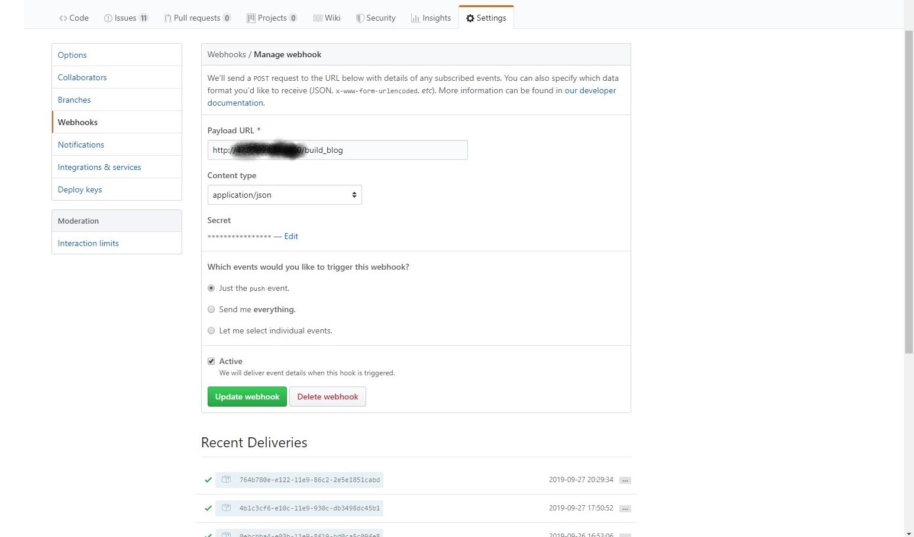
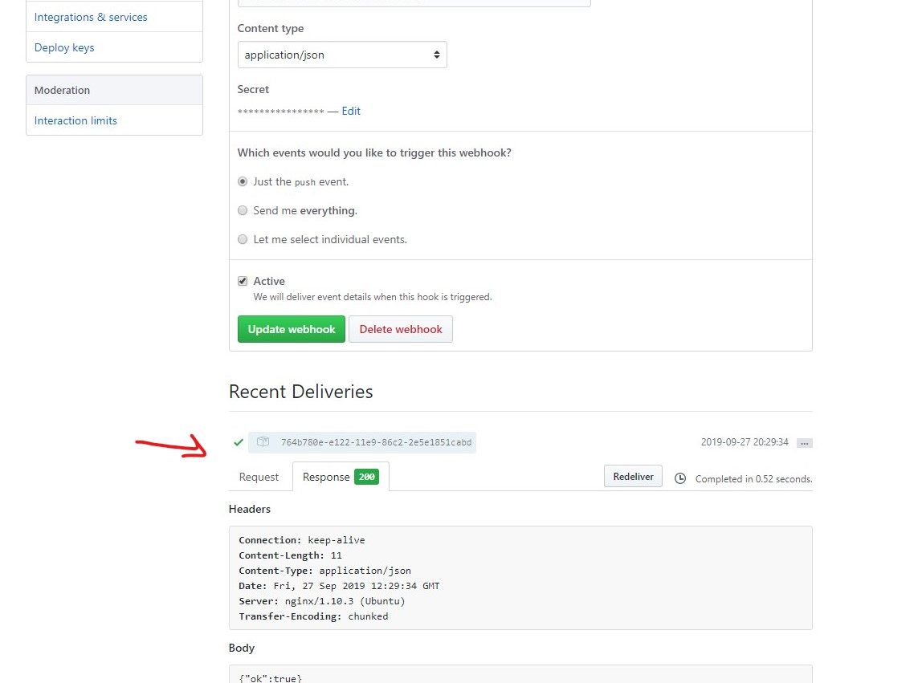

## 为什么需要持续部署

继我的博客[成功部署在阿里云](/blog/deploy)之后,为了让其有像`netlify`一样的`热更新`体验,开始尝试自实现持续部署

持续部署,这个功能在几乎所有的托管平台上都有,这也是为什么之前热衷于将自己的项目放在他们上面的原因,因为这个功能可以自动化的将修改后的代码同步更新到生产环境中并自动部署.

可以试想一下,一个上线的项目每天都会有人提交代码到仓库,若想保持项目的最新,必须每天都要重新构建发布,如果项目发布过程非常麻烦,那么这些每天重复的劳动将造成巨大的浪费.所以,这个时候,比如我的小博客,经常发文章的话,采用持续部署的方式,只需将代码推送到仓库就能自动部署,可以大大节省时间和精力.

## 如何实现持续部署

### 首先我们需要捋一下流程

> 本地修改代码==>push 代码到仓库==>收到 Push,启动部署程序==>生产环境 pull 代码==>重新 build 文件(npm build)

 git仓库[style=bold,label="push"];
user1 -> git仓库[style=bold,label="push"];
user3 -> git仓库[style=bold,label="push"];
git仓库 -> 生产环境[label="hook 钩子通知服务器"];
生产环境 -> 启动部署[label="开启构建程序"];
启动部署-> 成功构建[label="执行构建命令"];
}
'/>

### 两种方案

可以看出要实现持续部署最关键的就是在`push`到仓库后能够顺利触发钩子到生产环境。通过查阅，发现有大概有两种方法实现：

- jenkins，这个是非常成熟且完备的持续集成的工具，只需要下载后进行一系列配置，就能够实现比较复杂的持续部署
- DIY 搭建一个钩子接口，利用 github 上的 webhook，接受其 hook 发送的数据，执行部署命令

经过考虑，这里使用第二种方案，自己搭建一个接口，因为博客项目部署太过简单，用 jenkins 简直就是大材小用

## 实现部署

### 配置 GitHub 的 webhook

webhook 可以让代码 push 到仓库的时候发送一个`POST`请求,请求体为这次`push`的各种信息


### 搭建接受 webhook 请求的接口

首先进入服务器中创一个文件夹,这里为`/mybolg_CI`

然后开始编写接口文件  
这里为了方便就直接使用官方给的一个包,[github-webhook-handler]('www),里面已经完成了对 webhook 请求处理的封装.  
`npm init`,`npm install github-webhook-handler`

```js
var http = require("http")
var createHandler = require("github-webhook-handler")

var handler = createHandler({ path: "/build_blog", secret: "********" }) //path 为webhook中URL路径,secret为webhook中设置的密码

http
  .createServer(function(req, res) {
    handler(req, res, function(err) {
      res.statusCode = 404
      res.end("no such location")
    })
  })
  .listen(6666)

handler.on("error", function(err) {
  console.error("Error:", err.message)
})

// 监听到push事件的时候执行我们的自动化脚本
handler.on("push", function(event) {
  console.log(
    "Received a push event for %s to %s",
    event.payload.repository.name,
    event.payload.ref
  )
})
```

### 编写部署的命令文件

成功接收到 webhook 通知后,就需要开始真正执行部署的操作,这里的操作就是自己手动部署的流程,如`git pull` ,`npm build`  
那么像这样的命令,如何让服务器自己执行呢? 用`sh`文件,`sh`是`shell`文件,是 linux 的一个常用的命令行程序,将一系列命令写入此类文件中,然后开启就会执行文件中的命令
这里在`/myblog_ci`文件下`touch ci.sh`,这里简单编写

```sh
#!/bin/bash
# 纪录响应日志到`githook_log.txt`
exeDate1=$(date +"%Y-%m-%d %H:%M:%S")
echo $exeDate1" 收到push命令,开始执行shell" >> /home/ci/myblog-ci/githook_log.txt
git pull
cnpm install
npm run build
exeDate2=$(date +"%Y-%m-%d %H:%M:%S")
echo $exeDate2" 成功构建" >> /home/ci/myblog-ci/githook_log.txt

```

### 在接口响应时执行 sh 文件

这就要就在 js 文件中执行 shell 命令,这里可以用 node 中的 child_process 模板

```js
// index.js

var { exec } = require("child_process") //node中子进程调用文件模块

//...

//在push回调中添加
handler.on("push", function(event) {
  console.log(
    "Received a push event for %s to %s",
    event.payload.repository.name,
    event.payload.ref
  )
  // 执行`sh ci.sh`命令
  exec("sh ci.sh", (err, stdout, stderr) => {
    if (err) {
      console.error(err)
      return
    }
    console.log(stdout)
  })
```

### 为接口设置代理

为了不多开放一个端口并让其 6666 访问,直接在开放的 80 端口上用 NGINX 上设置一个代理

```NGINX
        location ~ /build_blog {
        proxy_pass http://127.0.0.1:6666;
         # try_files $uri $uri/ =404;
        }


```

## 最后 push 测试

### 查看 webhook



### 查看 githook_log

`githook_log.txt`

```txt
2019-09-27 20:29:34 收到push命令,开始执行shell
2019-09-27 20:29:37 成功拉取
2019-09-27 20:29:55 成功构建
```

OK!看到这些信息说明成功收到 webhook 并且成功构建,自动部署成功实现!!
