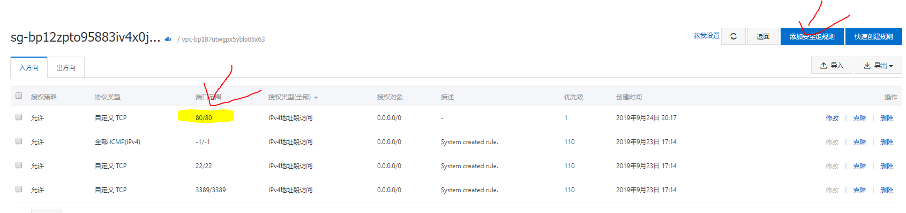

## 从未预料过的艰难

在自己的服务器上部署自己的项目,这个想法其实从学习编程的一开始就有,并且一直也在关注和学习这方面的知识,什么`docker`,`微服务`,`Serverless`都有所涉猎,但是由于有 netlify 和 heroku 这样方便好用的托管平台,就一直没有真正动手去部署服务器.

终于,在邻近祖国 70 岁生日的日子里,国内高墙筑起,我部署在 netlify 的网站已然上不去,我想我一直学习的部署知识可以派上用场了.第一次,我先试试部署一个静态内容,我想这对来说应该很快就能搞定吧~~

万万没想到,在阿里云上部署一个静态页面却整整耗了一个下午,一个简单的流程下却有那么多坑,作为一次部署,必须纪录下这次所走的坑.

## 部署过程

### 配置环境

`ssh root@ip` 首先用 ssh 协议连接到远程服务器

`apt update` 更新 apt(linux 下的包管理工具)的仓库包到最新

> 遇到的第一个坑,由于没有执行这步,导致下载的 node 版本太低

`apt install nodejs` 安装 node,用于 webpack 构建静态页面

`node --version`,
`npm --version` 查看版本确保存在并够新

`npm install -g cnpm --registry=https://registry.npm.taobao.org`,毕竟是因为有墙才部署阿里云的,所以肯定要用淘宝镜像的 npm

### 导入项目

`mkdir apps` ,创建一个文件夹,由于默认进入阿里云是 root 账户,所以该文件在 root 下

`cd apps`,  
`git clone myproject` 导入项目

`cd myproject`,  
`cnpm install` 安装依赖

`npm run build` 构建静态文件,我这是 GATSBY,构建完的文件为根目录下的 public

### 配置 NGINX

`apt install nginx` 安装 NGINX

> 这里遇到第二个坑,安装完后应该就可以直接在服务器 ip 访问,但是就算后来怎么配置文件都访问不了,最后发现是阿里云的防火墙是默认是关闭端口的,需要在控制台添加 NGINX 输出的 80 端口,当然也可以自行在 Linux 中配置防火墙



`nano /etc/nginx/sites-available/default` 用 nano 编辑器打开 NGINX 配置文件,修改资源目录为 public 目录

```nginx
server {
        listen 80 default_server;
        listen [::]:80 default_server;
        # 你的服务器域名(ip),设置为_则表示通配
        server_name _;


        location \ {

                # 静态文件夹地址
                root /root/apps/myproject/public/;
                # 默认查找文件夹下的index文件作为返回页面
                index index.html index.htm ;
                try_files $uri $uri/ =404;
        }

    }
```

`nginx -t` 配置完后检测一下是否配置规范

`server nginx restart` 重启下服务器

> 这里遇到第三个大坑,配置完启动后访问页面返回 403,这个非常熟悉的数字,表示没有权限...又是莫名其妙的问题,只有百度谷歌了.  
> 原来,root 下的文件夹普通用户是没有权限访问的,而 NGINX 默认用户为 nobody,所以有两个解决办法.
>
> 1. 更改 NGINX 下的根配置文件,目录为`etc/nginx/nginx.conf`,进入后更改第一行的 uesr 为 root
> 2. 将项目移动至`home`目录下,然后修改下之前的配置,我这里就用的这个方案

## 总结

写完发现这个部署步骤真的很少,但是其中很多东西由于之前没使用过,一直停留在理论,导致遇到问题不能快速处理,所以还是要实践才能出真知.总之,这次部署让我更加熟悉了 Linux 和 NGINX,也算是不小的收获,那么过几天再为项目配置个持续部署([已完成](/blog/continuous-deploy)).
