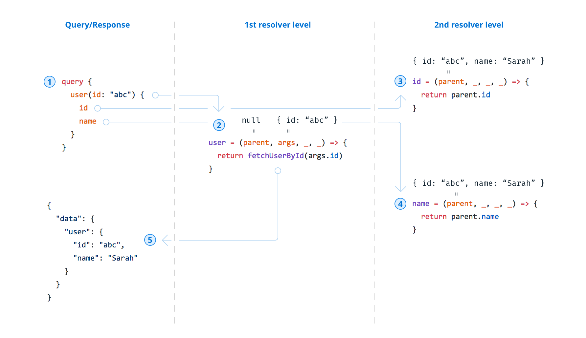

> 太久没写博客了，先翻译一篇博客压压惊。为什么要翻译这篇呢？一是最近在学 GraphQL，对其中有些概念非常模糊，这篇博客非常清晰的解释了其中一些主要的概念。二是正好学习一篇好的技术博客的结构与表诉方法

**原文**：[_GraphQL Server Basics: GraphQL Schemas, TypeDefs & Resolvers Explained_](https://www.prisma.io/blog/graphql-server-basics-the-schema-ac5e2950214e) ——Nikolas Burk

# GraphQL 服务基础: GraphQL Schemas, TypeDefs & Resolvers 的解释

当我们谈到 graphQL 时，第一个问题就是我们如何建立一个 GraphQL 的服务，GraphQL 已经作为一个规范发布，你的 GraphQL 服务可以真正的用你青睐的语言来实现。
在开始搭建一个服务之前,GraphQL 要求你设计一个用来定义你的服务 API 的 schema。我们希望这篇文章能够帮助理解 schema 主要的组成部分，揭示其实际应用的机制，并了解像 GraphQL.js、G-tools 和 graphe-js 这些库如何帮助你搭建 GraphQL 服务。

## GraphQL schema 定义服务的 API

> schema 用来定义关系，描述接口，从而提供了 client-server 间相互通信的一个清晰的契约

GraphQL 拥有自己的类型语言来编写 GraphQL schema 语言(Schema Definition Language,下文称 SDL)
像这样

```js
type User {
id: ID!
name: String
}
```

这个单独的`User` type 并没有暴露出任何的功能，只是简单的定义了`User`的*model*结构。让这个 API 有功能我们需要在 GraphQL Schema 的`root types`上添加几个主要字段:`Query`,`Mutation`和`Subscription`。这些类型定义了 GraphQL API 的 入口
像这样

```graphql
query {
  user(id: "abc") {
    id
    name
  }
}
```

这个`query`只有当 对应 GraphQL schema 定义了如下的 type 时才会有效

```js
type Query {
  user(id: ID!): User
}
```

所以 schema 的 root types 决定了怎样的`query`与`mutation`能被所服务端接受

## GraphQLSchema 对象是 GraphQL server 的核心

GraphQL.js 是 facebook 对 GraphQL 的参考实现，并已该基础创建了很多其他的库，例如`graphql-tools` 和 `graphene-js`。当我们使用这些库时，我们开发的中心都会在`GraphQLSchema`对象上，它主要由两个部分组成：

- schema 的定义
- 以解析器（resolver）函数形式的实际实现

向上面的例子，`GraphQLSchema` 对象就像这样

```js
const UserType = new GraphQLObjectType({
  name: "User",
  fields: {
    id: { type: GraphQLID },
    name: { type: GraphQLString },
  },
})

const schema = new GraphQLSchema({
  query: new GraphQLObjectType({
    name: "Query",
    fields: {
      user: {
        type: UserType,
        args: {
          id: { type: GraphQLID },
        },
      },
    },
  }),
})
```

正如你所看到的，SDL 可以直接被翻译成*javascript*来表达`GraphQLSchema`。注意这个 schema 没有任何的`resolver`，所以它不允许你用来实际执行任何`query`与`mutation`。让我们在下一部分谈论这些

## Resolvers 来实现 API

### GraphQL 服务中的结构与行为

GraphQL 对结构与行为有一个清晰的分离，GraphQL 服务的结构 就像之前讨论的`schema`一样，对服务功能的一个抽象描述，它是服务行为实现的目标。在 GraphQL 中 实现结构的行为被称为`resolver`

> 每一个 schema 中的字段背后都有一个`resolver`

在大部分的基本形式中，GraphQL 服务器将为每个在`schema`中的字段提供一个`resolver`，每个`resolver`知道如何获取数据提供给该字段。由于 GraphQL 的`query`本质上是获取一些字段数据的集合，GraphQL server 需要做的就是触发其所有`query`字段的`resolver`functions 从而返回聚合的数据。(GraphQL 常常会被拿来与`RPC`(Remote Procedure Call Protocol)框架比较，因为他们本质都是触发远程的函数)

### resolver 的分解

在 GraphQL 中, `GraphQLSchema`内的`type`里的`fields`中的每一个字段都可以有一个 resolve function 。 让我们思考上面的例子，给 query`type`中的`user`字段添加一个简单的`resolver`

```js
const schema = new GraphQLSchema({
  query: new GraphQLObjectType({
    name: "Query",
    fields: {
      user: {
        type: UserType,
        args: {
          id: { type: GraphQLID },
        },
        resolve(root, args, context, info) {
          const { id } = args // the `id` argument for this field is declared above
          return fetchUserById(id) // hit the database
        },
      },
    },
  }),
})
```

假设`fetchUserById`能够返回一个包含`id`和`name`的对象，那么这个 resolve 能够成功的应用于这个`schema`

在我们更深入之前，可以花点时间来了解`resolver`接受的四个参数

1. `root`(也叫做`parent`，译者认为`parent`可能更利于理解),还记得我们说过 GrahpQL server 去解析一个`query`需要做的是去调用`query`字段的`resolver`吗？很好！它们的工作就像面包屑一样(一层接一层)，每一个传入`resolve`的`parent`是上级`resolve`的返回结果,因此最上级 resolve 的`parent`参数为`null`

2. `args`,在`query`中传递的参数，需要在字段的`args`中定义

3. `context`,一个在`resolver`链中一直传递的上下文对象（载体），可以被链中的每一个`resolver`读写(基本上是`resolver`共享与通信的方式)

4. `info`，`query`和`mutation`的抽象语法树(`AST`)表达式

之前我们说过每一个字段背后都会有一个`resolve` funciton，我们的`schema`有三个字段，而我们只有一个`resolver`,因此`UserType`中的`id`和`name`同样也分别需要`resolver`。你将会看到，这些`resolver`非常简单

```js
const UserType = new GraphQLObjectType({
  name: "User",
  fields: {
    id: {
      type: GraphQLID,
      resolve: (root, args, context, info) => {
        return root.id
      },
    },
    name: {
      type: GraphQLString,
      resolve: (root, args, context, info) => {
        return root.name
      },
    },
  },
})
```

### 查询的执行

从上面的例子来思考我们的查询，看看查询(`query`) 是如何被执行，数据是如何被收集的。上面的查询包含三个字段:`user`,`id`和`name`。这意味着服务器需要调用三个 resolve function。让我们来看看它的执行流程



1. `query`请求到达`server`
   The server invokes the resolver for the root field user — let’s assume fetchUserById returns this object: { "id": "abc", "name": "Sarah" }
2. `server`触发根字段`user`的`resolver`，假设`fetchUserById`返回`{ "id": "abc", "name": "Sarah" }`

3. `server`触发`user`的下游字段`id`和`name`的`resolver`，`{ "id": "abc", "name": "Sarah" }`将作为它们`resolver`的`parent`参数被调用
4. 同上 👆

5. 解析过程结束，结果被包裹成[GraphQL](http://spec.graphql.org/)规范的数据后返回：

```json
{
  "data": {
    "user": {
      "id": "abc",
      "name": "Sarah"
    }
  }
}
```

那么现在，你会觉得有必要专门给`user.id`和`user.name`写`resolver`吗？其实类似这样简单的`resolver`，你不必自己实现，由于 GraphQL.js 已经可以根据字段名称和根参数推断出需要返回的内容，因此可以省略其实现。

### 优化请求：DataLoader 模式

像上面描述的执行方法，在客户端发送`query`深度字段时非常容易产生性能问题。假设我们的`user`还有`articles`字段：

```graphql
query {
  user(id: "abc") {
    name
    article(title: "GraphQL is great") {
      comments {
        text
        writtenBy {
          name
        }
      }
    }
  }
}
```

注意，我们正在请求给定`user`的特定`article`，包括它的`comments`以及写评论的`user`  
假设该文章有 5 个评论，且都是同一个用户所评论。这就意味着我们会对返回同样一个结果`resolver`触发 5 次。`DataLoader`的出现就是优化这样 N+1
的 query 问题————通常解决这个问题的想法是：对所有`resolver`统一批处理一次，相同结果的`resolver`只会调用一次

> 想了解更多有关于`DataLoader`? 可以观看 Lee Byron 的 video - [Source code walkthrough (~35 min)](https://www.youtube.com/watch?v=OQTnXNCDywA)
