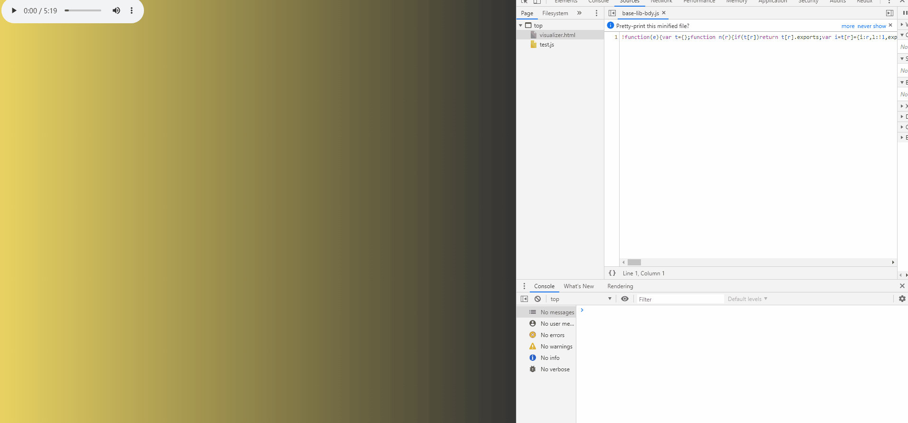
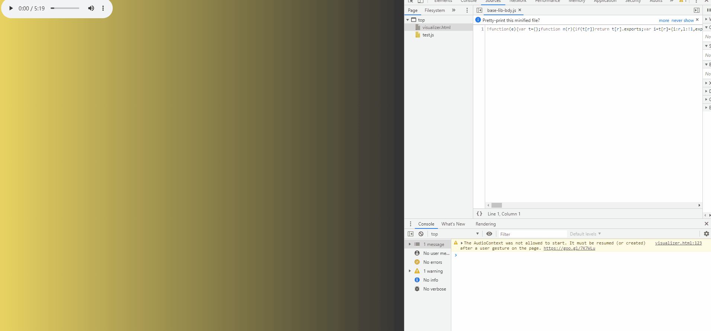
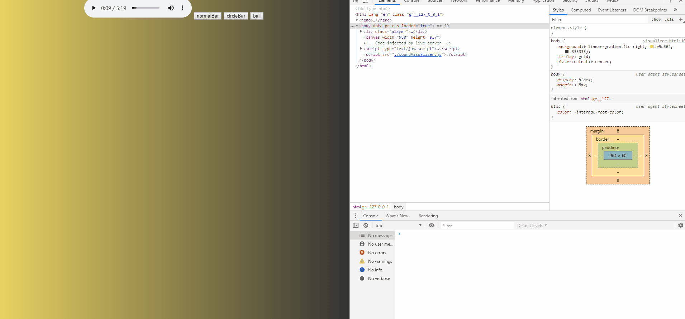

这几天想给这个博客做个音乐播放器,收藏和分享喜欢的音乐,用来在 coding 的时候后台播放,但是想了想除了做个后台之外,前端的东西能做的太少了,于是想到为什么不能做个炫酷歌曲音频可视化呢?

## 主要思路

### 获取音频接口,得到音频数据

查阅 Mozilla 找到,web 的的 audioContext,可以生成音频对象,通过这一接口可以对其操作,这一对象功能的实现一般要通过一个专门的流程:  
source(声音源)=>middle(声音处理器,包括混响,过滤器,还有我们需要的音频分析器)=>terminal(输出终端)

> 让我看看官方的图:  
> 

现在,尝试一下接口

```js
//获取媒体元素,用来生成声音源
let audioElement = document.querySelector("audio")
// 设置允许跨域,audioContext连接对跨域有限制
audioElement.crossOrigin = "anonymous"
let audioCtx = new AudioContext()
//利用接口得到分析器
let analyser = audioCtx.createAnalyser()
//得到音源
let source = audioCtx.createMediaElementSource(audioElement)
// source=>middle
source.connect(analyser)
//middle=>termial
analyser.connect(audioCtx.destination)
// 设置傅里叶变化的参数,用来设置分析范围
analyser.fftSize = 128
//根据范围得到不同音频的数量的长度
let bufferLength = analyser.frequencyBinCount
//生成8位为一个item,长度为bufferLength的array
let dataArray = new Uint8Array(bufferLength)
//  将频率导入到该array
analyser.getByteFrequencyData(dataArray)
```

最后,让我们播放音乐,持续输出这个 Array

```js
audioElement.play()
setInterval(() => {
  let dataArray = new Uint8Array(bufferLength)
  analyser.getByteFrequencyData(dataArray)
  console.log(dataArray)
}, 1000)
```

Bingo!!成功得到了数据


### 连接音频数据,导入 canvas 绘图

让数据对应图形,最容易想到的就是讲每个数据具象为`canvas`图形的参数,做一个最简单的对应.

> 将不同的音频生成相应数量的矩形,然后依次排列,每个的高度等于其音频的大小.

尝试一下

```js
// 获取canvas,canvarCtx
const canvas =document.querySelector('canvas')
const canvasCtx = canvas.getContext('2d')

//一次绘制
function draw(){
  let  dataArray = new Uint8Array(bufferLength)
  analyser.getByteFrequencyData(dataArray)
  const bar_w = canvas.width / bufferLength;
  for (let i = 0; i < bufferLength; i++) {
      let bar_x = i * bar_w;
      let  bar_h = (dataArray[i] / 255) * canvas.height;
      let bar_y = canvas.height - bar_h
      canvasCtx.fillStyle = `green`;
      canvasCtx.fillRect(bar_x, bar_y, bar_w, bar_h);
    }
  }
}
```

然后,组成动画

```js
function rockMusic() {
  requestAnimationFrame(rockMusic)
  analyser.getByteFrequencyData(dataArray)
  draw()
}
```



## 花样拓展

将数据具象为各种图形样式

### 做个环绕型的 bar

> 环绕的话,需要设置绕环原点,要用到`canvasCtx.translate`和`canvasCtx.rorato`

效果


### 做个动感球

> 这个球要能动的话,则需要将其保存为对象,需要一个容器然后 forEach

效果


## 总结

这里只是简单的使用了 webAudio 的一个小小的分析器,我想这个东西应该还可以有很多有专业的东西可以挖掘;另外,在可视化中,我也只是用了简单的 canvas,有兴趣的同学可以利用其他的库自己设计各种炫酷的效果.

最后,附上源码[git](https://github.com/scout9II/JS-30days-30miniprojects/tree/master/day16-soundVisualizer)
